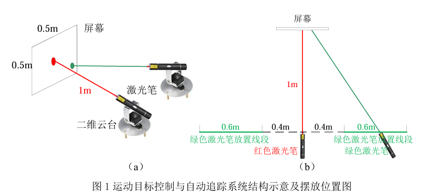
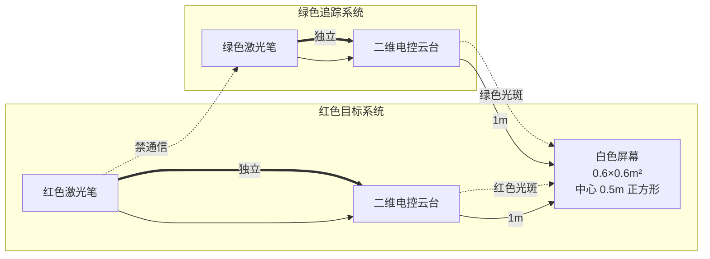

# 运动目标控制与自动追踪系统（E 题）

## 一、任务

​	设计制作一个运动目标控制与自动追踪系统。系统包括模拟目标运动的红色光斑位置控制系统和指示自动追踪的绿色光斑位置控制系统。系统结构示意及摆放位置见图 1（a）。图中两个激光笔固定在各自独立的二维电控云台上。

​	红色激光笔发射的光斑用来模拟运动目标，光斑落在正前方距离 1m 处的白色屏幕上，光斑直径≤1cm。红色光斑位置控制系统控制光斑能在屏幕范围内任意移动。

​	绿色激光笔发射的光斑由绿色光斑位置系统控制，用于自动追踪屏幕上的红色光斑，指示目标的自动追踪效果，光斑直径≤1cm。绿色激光笔放置线段如图 1（b）所示，该线段与屏幕平行，位于红色激光笔两侧，距红色激光笔距离大于 0.4m、小于 1m。绿色激光笔在两个放置线段上任意放置。

​	屏幕为白色，有效面积大于 0.6×0.6m²。用铅笔在屏幕中心画出一个边长 0.5m 的正方形，标识屏幕的边线；所画的正方形的中心为原点，用铅笔画出原点位置，所用铅笔痕迹宽≤1mm。

### 系统结构（Mermaid）

### 关键参数表

| 参数 | 数值 | 说明 |
|------|------|------|
| 屏幕距离激光笔 | 1 m | 正前方 |
| 屏幕有效面积 | > 0.6×0.6 m² | 白色 |
| 标识正方形边长 | 0.5 m | 屏幕中心 |
| 红色激光笔放置范围 | 距屏幕 0.6 m | 居中 |
| 绿色激光笔放置范围 | 距红色笔 0.4–1 m | 两侧线段 |
| 光斑直径 | ≤ 1 cm | 红/绿 |
| 铅笔痕迹宽 | ≤ 1 mm | 原点标识 |

## 二、要求

### 1. 基本要求

1. **位置复位**：执行复位功能，红色光斑能从屏幕任意位置回到原点。光斑中心距原点误差≤2cm。
2. **四周边线扫描**：红色光斑能在 30 秒内沿屏幕四周边线顺时针移动一周，移动时光斑中心距边线距离≤2cm。
3. **A4 靶纸（正向）**：用约 1.8cm 宽的黑色电工胶带沿 A4 纸四边贴一个长方形，构成 A4 靶纸，贴在屏幕自定位置。红色光斑能在 30 秒内沿胶带顺时针移动一周。超时不得分；完全脱离胶带一次扣 2 分；连续脱离胶带移动 5cm 以上记为 0 分。
4. **A4 靶纸（任意旋转）**：将上述 A4 靶纸以任意旋转角度贴在屏幕任意位置，要求同（3）。

### 2. 发挥部分

1. **一键追踪**：目标位置复位后，一键启动自动追踪，绿色光斑需在 2 秒内追上红色光斑，追踪成功后发出连续声光提示；两光斑中心距离应≤3cm。
2. **动态追踪**：目标重复基本要求（3）~（4）动作，绿色激光笔可放置在其线段任意位置，同时启动运动与追踪系统，2 秒后应追踪成功并连续声光提示。追踪过程中两光斑中心距离 > 3cm 即视为追踪失败，一次扣 2 分；连续失败 > 3 秒记为 0 分。
   - 两系统均需设置**暂停键**；同时按下暂停键，红、绿光斑立即制动以便测量。
3. **其他**。

## 三、说明

1. 红色、绿色光斑位置控制系统必须相互独立，之间不得有任何方式通信；光斑直径小于 1cm；屏幕上无任何电子元件；控制系统不能采用台式计算机或笔记本电脑。不符合要求不进行测试。
2. 基本要求（3）、（4）未得分不进行发挥部分（2）的测试。
