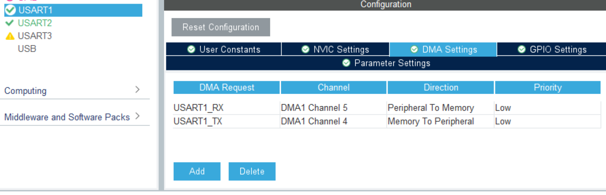

[toc]

# 模块名:

## 1. 项目简介

* **功能**:**实现单片机及蓝牙之间的信息通信,并且通过约定协议保证一定的信息传输准确性**
* **传输**:采用数据包传输,传输方式有HEX(16进制)传输和文本(ABC)传输两种
* **传输协议**:
  * HEX传输:	
    * 协议:==帧头1(0xFF) + 帧头2(0xAA) + 数据个数 + 数据 +帧尾1(0x55) + 帧尾2(0xFE)==
    * 帧头1:0xFF    帧头2(0xAA)
    * 数据个数:使用高低位传输方式,即高位+低位为1位有效数据,所以个数必为偶数,==并且由此单片机进行HEX传输都需要将有效数据转为高低位再传输==
    * 数据:高低位
    * 帧尾1:0xFE       帧尾2(0x55)
  * 文本传输:
    * 协议:==帧头('@') + 指令 + 1号帧尾('$') + 2号帧尾('#')==
    * 帧头:'@'
    * 指令:**建议采用"变量=数据"的形式**,可以使数据解析变得方便许多,同时不要有空格例:`"Kp=0.2"`
    * 1号帧尾:'$'
    * 2号帧尾:'#'

## 2. 核心功能

* 得到解析后的数据包

  * HEX:`int`数组,第0位为数据的个数(不含本位),后面就是解析好了的有效数据

  ```c
  // HEX接收数据包
  typedef struct
  {
  	int Serial_New_Package[RX_Serial_LEN] ; 		// 正确信息存储数组,长度管够,以后再改
  	bool Serial_New_Package_Flag ;							// 数据包解析完成flag
  	int error_Serial	;								  				// 错误查询参数
  }Serial_HEX_Data_Typedef;
  ```

  * 文本:`char *`字符串,即指令

  ```c
  // 文本接收数据包
  typedef struct
  {
  	char Serial_New_Package_ABC[RX_Serial_LEN] ; // 正确信息存储数组,长度管够,以后再改
  	bool Serial_New_Package_Flag ;							 // 数据包解析完成flag
  	int error_Serial	;								  				 // 错误查询参数
  }Serial_ABC_Data_Typedef;
  ```

* 判断数据包更新与否

  * 实现主函数调用数据包之前看看有没有更新,否则无法判断数据的新旧

  ```c
  // HEX:得到错误原因
  int Serial_GetError_HEX(void) ;
  
  // 文本:得到错误原因
  int Serial_GetError_ABC(void) ;
  ```

## 3. 核心函数

```c
// DMA串口接收初始化
void Serial_Init(UART_HandleTypeDef *huart) ;

// 串口发送数组
void Serial_SendData_DMA(uint8_t *pData, uint16_t Size) ;

// HEX:得到串口接收标志位
uint8_t Serial_GetNewPackageFlag_HEX(void) ;

// HEX:得到错误原因
int Serial_GetError_HEX(void) ;


// 文本:得到串口接收标志位
uint8_t Serial_GetNewPackageFlag_ABC(void) ;

// 文本:得到错误原因
int Serial_GetError_ABC(void) ;

// 文本:1. 封装一个函数,实现简易浮点数变量调试
bool Serial_SetFloatData( char *KeyWord , char *cmd , float *Data) ;

// 文本:2. 封装一个函数,实现简易整数变量调试
bool Serial_SetIntData( char *KeyWord , char *cmd , int *Data) ;
```

## 4. 基础必备代码

### 4-1 库导入

```c
// 系统库
#include <stdlib.h>
#include "string.h"
#include <stdio.h>
// 自设库
#include "Serial.h"
```


### 4-2 全局变量(域)

```c
extern Serial_HEX_Data_Typedef   Serial_Hex_Data ;			// 解析好的HEX数据包
extern Serial_ABC_Data_Typedef   Serial_ABC_Data ;			// 解析好的ABC数据包
```


### 4-3 setup

```c
// *串口初始化*
Serial_Init(&Serial_huart) ;
```


### 4-4 while

```c
无
```


### 4-5 while后函数

```c
无
```


## 6. 功能示例代码

* HEX:

```c
if (Serial_GetNewPackageFlag_HEX() == 1)
{
    // OLED展示各个数据
    OLED_ShowNum(0 , 20 , Serial_Hex_Data.Serial_New_Package[0] , 1 , OLED_8X16 ) ;
    for (int i = 1 ; i < Serial_Hex_Data.Serial_New_Package[0] + 1 ; i ++)
    {
        OLED_ShowNum(20 , 10 + 10 * i , Serial_Hex_Data.Serial_New_Package[i] , 5 , OLED_6X8 ) ;
    }
}
```

* 文本(ABC):

```c
if (Serial_GetNewPackageFlag_ABC() == 1)
{
    // 文本包调试程序
    Serial_SetFloatData("Kp" , "Kp=%f" , &kp) ;
    Serial_SetFloatData("Ki" , "Ki=%f" , &ki) ;
    Serial_SetFloatData("Kd" , "Kd=%f" , &kd) ;

    // OLED展示
}
```

## 5. Cube配置

* USART1:




* ==**USART2类似**==

## 7. 引脚定义

| 引脚号 |   标签    |
| :----: | :-------: |
|  PA9   | USART1_TX |
|  PA10  | USART1_RX |
|  PA2   | USART2_TX |
|  PA3   | USART2_RX |

注:双串口,可以连蓝牙了

## 8. 注意事项

### 8-1 代码迁移:

​	只需要在`Serial.h`中将

```c
#define Serial_huart huart2
#define Serial_USART USART2
```

​	改为`huartx` / `USARTx`即可(x自己另配置)

​	十分方便:smile:

### 8-2 关于数据包大小与数据溢出阈值

* 数据包大小:

```c
// DMA接收数组长度
#define RX_Serial_LEN 50
```

​	我都设置成50了,后面遇到了相应情景再进行缩减或者扩大

* 数据溢出阈值:
  * 首先跟数据包大小有关
  * 其次在**文本**模式下是有数据溢出阈值的,下面是长度,看以后指令为多少就再改即可

```c
// DMA等待帧尾判断溢出阈值
#define Serial_Wait_Tail_MAX 25
```

## 9. 更新日志

* 2025/10/12
  * 完成该工程
* 
