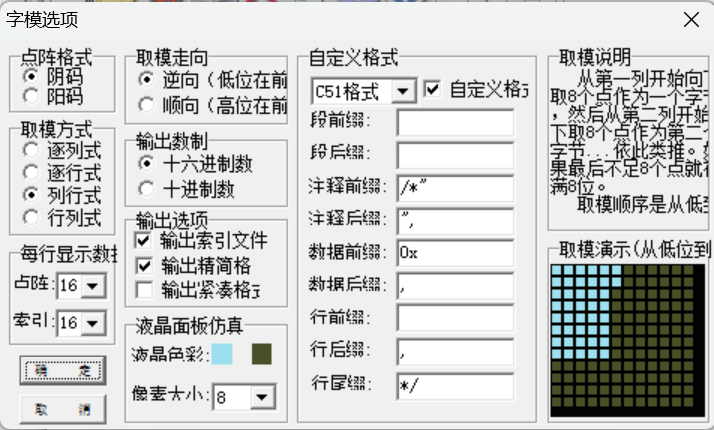
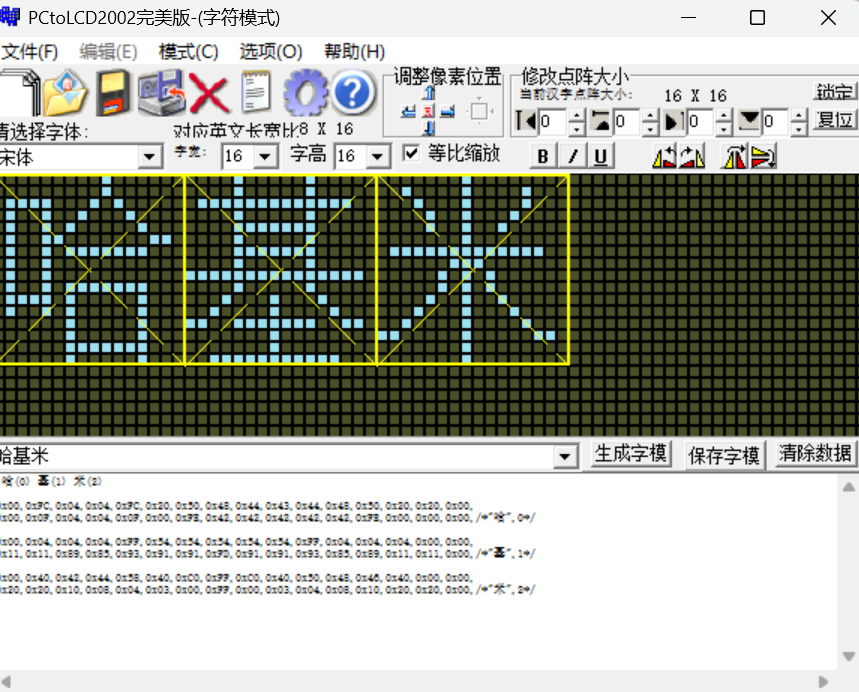

[toc]

# OLED

## 1. 简介

* 采用江协科技OLED库(v1.2版本),进行了STM32F1标准库到STM32F1HAL库的移植

* 采用软件**模拟IIC**形式,**节省资源**

## 2. 引脚配置

| 引脚号 | 初始电平 | GPIO模式 | 上下拉 | 引脚速度 |   标签   |
| :----: | :------: | :------: | :----: | :------: | :------: |
|  PB8   |   LOW    |    PP    |   NO   |   HIGH   | OLED_SCL |
|  PB9   |   LOW    |    PP    |   NO   |   HIGH   | OLED_SDA |

## 3. 基础配置代码

* include

* setup:

```c
// OLED初始化
OLED_Init() ;
```

* while:

```c
// OLED刷新(必要,建议放在最后)
OLED_Update() ;
```

## 4. 核心功能

### 1.数字显示

* 指定长度大于实际长度就在前面补0
* 指定长度小于实际长度则高位丢失

### 2.添加汉字

右键`OLED_ShowChinese`跳转定义看方法

**重点是跑到`data.c`里面定义数据**

使用软件配置:

①先模式(C)设置为字符模式



②随意配置相关,不过保持不变也没事



### 3. 图像显示

**重点是跑到`data.c`里面定义数据**

① 设置模式(C)为图形模式,再点击新建按钮手绘,输入宽高,画完之后生成字模即可

② 跑到`data.c`照猫画虎即可

```c
/*测试图像（一个方框，内部一个二极管符号），宽16像素，高16像素*/
const uint8_t Diode[] = {
	0xFF,0x01,0x81,0x81,0x81,0xFD,0x89,0x91,0xA1,0xC1,0xFD,0x81,0x81,0x81,0x01,0xFF,
	0xFF,0x80,0x80,0x80,0x80,0x9F,0x88,0x84,0x82,0x81,0x9F,0x80,0x80,0x80,0x80,0xFF,
};

/*按照上面的格式，在这个位置加入新的图像数据*/
//...自己的DIY格式自己照猫画虎
```

③ 跑到`data.h`照猫画虎即可

```c
/*图像数据声明*/
extern const uint8_t Diode[];
/*按照上面的格式，在这个位置加入新的图像数据声明*/
//...
```

④ 完成,可以去主程序`OLED_ShowImage`了

==更复杂的大图显示:具体见[江协科技的B站视频](https://www.bilibili.com/video/BV1EN41177Pc?spm_id_from=333.788.videopod.episodes&vd_source=362392e571870fdd0784b51ea97fc582&p=2),就不拓展学习了==

### 4. `OLED_Printf`

​	具体功能和C语言一样的

### 5. 绘图函数

| 函数定义                                                     | 功能解释                                                     |
| ------------------------------------------------------------ | ------------------------------------------------------------ |
| `void OLED_DrawPoint(int16_t X, int16_t Y);`                 | 在坐标 `(X, Y)` 处绘制一个像素点。                           |
| `uint8_t OLED_GetPoint(int16_t X, int16_t Y);`               | 获取坐标 `(X, Y)` 处像素点的状态（点亮/熄灭）。              |
| `void OLED_DrawLine(int16_t X0, int16_t Y0, int16_t X1, int16_t Y1);` | 绘制从 `(X0, Y0)` 到 `(X1, Y1)` 的直线。                     |
| `void OLED_DrawRectangle(int16_t X, int16_t Y, uint8_t Width, uint8_t Height, uint8_t IsFilled);` | 绘制矩形，左上角 `(X, Y)`，指定宽度和高度，`IsFilled=1` 表示填充矩形，`0` 表示只画边框。 |
| `void OLED_DrawTriangle(int16_t X0, int16_t Y0, int16_t X1, int16_t Y1, int16_t X2, int16_t Y2, uint8_t IsFilled);` | 绘制三角形，三点坐标分别为 `(X0, Y0)`、`(X1, Y1)`、`(X2, Y2)`，`IsFilled=1` 表示填充，`0` 表示只画边。 |
| `void OLED_DrawCircle(int16_t X, int16_t Y, uint8_t Radius, uint8_t IsFilled);` | 绘制圆形，圆心 `(X, Y)`，半径 `Radius`，`IsFilled=1` 表示填充，`0` 表示只画圆周。 |
| `void OLED_DrawEllipse(int16_t X, int16_t Y, uint8_t A, uint8_t B, uint8_t IsFilled);` | 绘制椭圆，圆心 `(X, Y)`，长轴 `A`，短轴 `B`，`IsFilled=1` 表示填充，`0` 表示只画椭圆边界。 |
| `void OLED_DrawArc(int16_t X, int16_t Y, uint8_t Radius, int16_t StartAngle, int16_t EndAngle, uint8_t IsFilled);` | 绘制圆弧，圆心 `(X, Y)`，半径 `Radius`，起始角度 `StartAngle`，结束角度 `EndAngle`，`IsFilled=1` 表示绘制扇形，`0` 表示只画圆弧。 |

### 6. 其他功能

详见库函数,比如调节对比度,屏幕翻转等


## 5. 代码移植

### 1. 移植库导入

​	`#include "stm32f10x.h"`变为`#include "stm32f1xx.h"`,再加个`#include "main.h"`也无妨

### 2. 移植核心函数

```c
#define OLED_W_SCL(x)		GPIO_WriteBit(GPIOB, GPIO_Pin_8, (BitAction)(x))
#define OLED_W_SDA(x)		GPIO_WriteBit(GPIOB, GPIO_Pin_9, (BitAction)(x))
```

​										变为

```c
void OLED_W_SCL( uint8_t x )
{
	if ( x )
	{
		HAL_GPIO_WritePin(GPIOB, OLED_SCL_Pin, GPIO_PIN_SET ) ;
	}
	else
	{
		HAL_GPIO_WritePin(GPIOB, OLED_SCL_Pin, GPIO_PIN_RESET ) ;
	}
}

void OLED_W_SDA( uint8_t x )
{
	if ( x )
	{
		HAL_GPIO_WritePin(GPIOB, OLED_SDA_Pin, GPIO_PIN_SET ) ;
	}
	else
	{
		HAL_GPIO_WritePin(GPIOB, OLED_SDA_Pin, GPIO_PIN_RESET ) ;
	}
}
```

​	变复杂的原因在于相关的库函数不同,并且其实后者的可移植性更强,因为对于相应的开发版的语法要求没有那么高了

​	其中`GPIO_WriteBit`变为了`HAL_GPIO_WritePin`,正是标准库 ---> HAL库

​	同时对于陌生的`BitAction`,移植时需要转到定义查看该语句的作用,发现仅是枚举类型,所以迁移使用if-else即可

​	最重要的是delay函数需要自己编写,其实相关内容也不难,就是数数而已,由于f4的开发板刷新块,所以必须加以延迟实现,否则无法显示,这里我参考了B站的视频

### 3. 除去无用部分

​	标准库中的引脚配置其实也就没有用了,毕竟HAL库已经配置好了,所以处理如下(注释掉不必要的部分)

```c
void OLED_I2C_Init(void)
{
//    RCC_APB2PeriphClockCmd(RCC_APB2Periph_GPIOB, ENABLE);
//	
//	GPIO_InitTypeDef GPIO_InitStructure;
// 	GPIO_InitStructure.GPIO_Mode = GPIO_Mode_Out_OD;
//	GPIO_InitStructure.GPIO_Speed = GPIO_Speed_50MHz;
//	GPIO_InitStructure.GPIO_Pin = GPIO_Pin_8;
// 	GPIO_Init(GPIOB, &GPIO_InitStructure);
//	GPIO_InitStructure.GPIO_Pin = GPIO_Pin_9;
// 	GPIO_Init(GPIOB, &GPIO_InitStructure);
	
	OLED_W_SCL(1);
	OLED_W_SDA(1);
}
```

注:

​	建议不要把整个函数注释掉或者去除它,留着总还是好的

### 4. 关于可移植性

* 引脚方面尽量使用宏定义将来容易更改

* 使用软件模拟OLED的IIC可以节省IIC资源