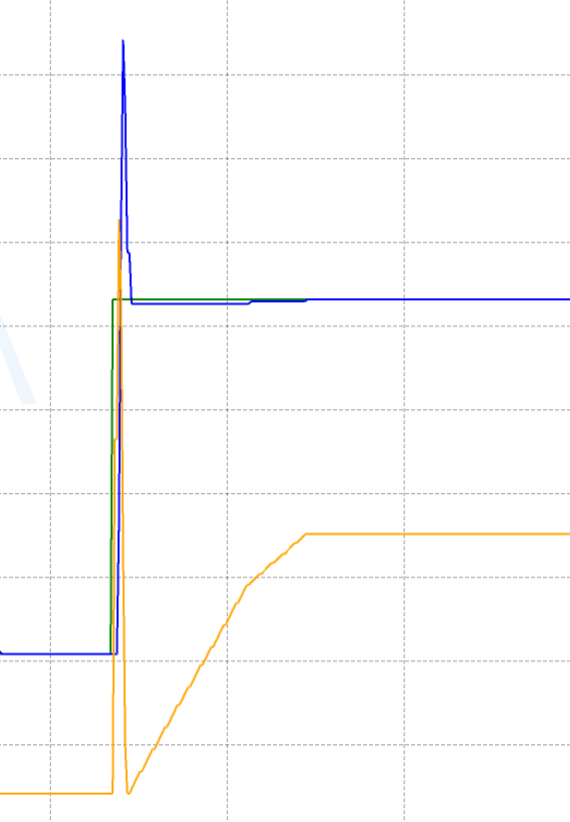
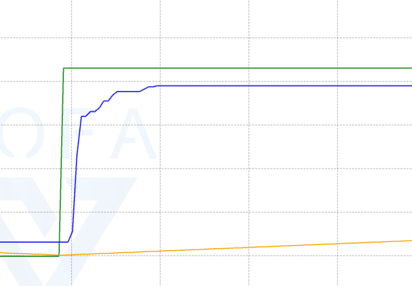
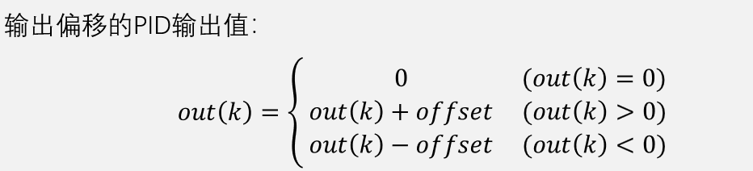
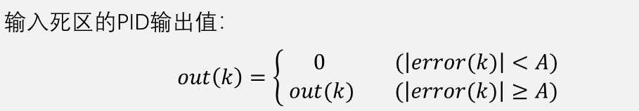

[toc]

## 0. 总结

1. 比例系数`Kp`
比例系数增加时，系统的响应速度会加快，系统的稳态误差则会降低。从而能够提高控制精度。
当比例系数`Kp`过大，会使系统出现超调量，导致系统发生振荡或使振荡次数增加，以至于系统的稳定性变低，反而延长了调节时间。
当比例系数`Kp`过小，系统调节将会变得缓慢。

2. 积分时间常数`Ki`
积分时间常数`Ki`主要对积分作用的强弱产生影响，主要作用是减少稳态误差，但是`ki`过大可能引起超调。

3. 微分时间常数`Kd`
微分时间常数`Kd`对系统的稳态过程不存在影响，仅在其动态过程中起作用。主要作用是减少超调。

一个编码器电机的几种情况:

1. 积分限幅必加,测算方法就是直接测最大摆动幅度,防止**意外故障**
2. 积分分离不用
3. 变速积分:调控 **超调**+**稳定性**
4. 微分先行:对抗**数据突变**导致的一瞬间正反馈
5. 不完全微分:过滤**杂波**
6. 输出偏移+输入死区:加快趋于**稳定性**,降低out**空转功耗**

## 1. ALL-积分限幅

### 1-2 概念:

​	积分限幅:(出现原因:`ActualSpeed`由于某种原因与`targetSpeed`相差过大并且持续很长时间,**导致积分累计过大,当情况恢复正常,积分累计无法完全变小为正常值,导致一段时间内`setSpeed`一直为MAX)**

​	所以需要限幅:

```c
// *积分限幅*
if (pid->SumError > 限幅)
{
    pid->SumError = 限幅 ;
}
else if (pid->SumError < -限幅)
{
    pid->SumError = -限幅 ;
}
```

### 1-2 参数测算方法:

​	方法:1.实测法,通过VOFA得到积分量的最大值,留点余量作为积分限幅 2.估算法:Output的MAX除以Ki(测好的正常值)即为限幅

## 2. 位置-积分分离

**介绍:**

​	 对于速度和位置两个课题,速度需要持续提供力,所以Ki积分项会与摩擦力平衡,所以real在接近目标时不会先超调再减弱为target
但是位置不一样,达到tar之后不需要再提供力或者是抵抗力,比如摩擦力,所以Ki的累次积分无处抵消,**一定会导致超调**,累次积分减小,最后回位

​	所以使用积分分离的方法:

```c
// ************** 删减 ***************
//	// 累次积分
//	pid->SumError += pid->PreError ;

// ************* 增加 **************
// 积分分离:误差较小时放弃累次积分
if (pid->PreError > -50 && pid->PreError < 50)	// 在一个小区间才能积分累计
{
    pid->SumError += pid->PreError;	// 继续累次积分
}
else
{
    pid->SumError = 0 ;							// 不需要加入积分了,防止积分超调
}
// ************* 结束 **************
```

​	但是这个方法太牢了,不如变速积分,所以看下面吧

## 3. 位置-变速积分

### 3-1 概念:

可以设置一个函数,对误差的**绝对值**变大的趋势是变小:

累次积分就计算为:

```c
C = 1.0f / (k * 1.0f * fabs(pid->PreError) + 1.0f) ;	// 函数还可以是别的
pid->SumError += C * pid->PreError;
```

使用变速积分的方法:

```c
// ************** 删减 ***************
//	// 累次积分
//	pid->SumError += pid->PreError ;

// ************* 增加 **************
C = 1.0f / (k * 1.0f * fabs(pid->PreError) + 1.0f) ;	// k的值自己测
pid->SumError += C * pid->PreError;

// ************* 结束 **************
```

那么k的取值决定了PID调控的两个参数:

* 超调:由于位置积分超调很有可能发生,所以需要误差较大时**`Ki`**的作用减**小**,使得**`Kp`**为主力,**所以C需要小一点**
* 稳定:在goal和real基本在一起时,`Kp`作用几乎没有了,需要靠`Ki`发力,由于驱动力不是线性的,所以需要累次积分不断变大,才能使得在set达到某个临界值电机才开始转动,那么这个时候累次积分变大的时间就要短一点,所**以C就需要大一点**

### 3-2 现象:

现象展示:极端验证:

蓝线为real,绿线为goal(突变),黄线为累次误差积分

1. **C超级大**:(k相当小),那么这个时候Ki对任何变动都很敏感,所以**稳定性强,超调高**:



如图:分为两部分:

* 第1部分:误差大,由于C很大(敏感),所以累次积分也变大,导致超调严重,同时`Kp`也在调控,导致整体超调
* 第2部分:但是后续的稳定性很强,因为`Ki`对这种很敏感,所以调控很快


2. **C超级小**:(k相当大):这个时候Ki很迟钝,所以超调小,稳定性低,因为要等很久累次积分才能累加完毕来应对微小差距



由于有差距,所以Ki发力,但是由于C小,所以增加的很迟钝,out不足以增大到使得电机开始进行哪怕很微小的转动,**导致稳定性差**

==所以如何选择C(即系数k)至关重要==

### 3-3 总结

* `pid->SumError += C * pid->PreError;`

  * C越大(k小),越敏感,所以超调大,稳定强
  * C越小(k大),越迟钝,所以超调小,稳定弱

  

* ==**其实可以尝试使用串口+VOFA打印`Kp,Ki,Kd`的输出值,看看超调时谁贡献的多,开始逼近时谁需要贡献,在通过函数拟合动态调节`Kp,Ki,Kd`的输出值的系数,得到最好的参数**==


## 4. 位置-微分先行

### 4-1 介绍

​	位置突变(比如突然变大),导致微分瞬间变大(导数大,所以微分大),而微分变大方向与位置变化方向相同,导致提供正反馈,导致该瞬间set还会因为微分的瞬间大输出而变大,但是我们本意是使其变小,所以这是需要解决的问题

### 4-2 方法:

KD计算公式从:

```c
Kd_OUT = Kd * ( 本次误差 - 上次误差)
```

变为:

```c
Kd_OUT = - Kd * (本次实际速度 - 上次实际速度) // 注意负号
```


## 5. ALL-不完全微分

### 5-1 介绍

对于杂波较多的场景,需要进行不完全微分,进行过滤,好处是变得平滑,坏处是位移延迟(毕竟与过去的值有关联)

### 5-2 方法:

```c
// ************* 删除 ************** 

//	DifOut = pid->Kd * pid->dError ;

// ************* 增加 ************** 
DifOut = (1.0f-a) * pid->Kd * pid->dError + a * DifOut ;	// a介于0到1,为浮点数
check[0] = DifOut * 100 ;
// ************* 结束 ************** 

float Output = pid->Kp * pid->PreError + pid->Ki * pid->SumError + DifOut;
```


## 6. ALL-输出偏移 + 输入死区

### 6-1 介绍

​	在goal和real基本在一起时,`Kp`作用几乎没有了,需要靠`Ki`发力,由于驱动力不是线性的,所以需要累次积分不断变大,才能使得在set达到某个临界值电机才开始转动(**与变速积分的稳定性高度重合**)

​	这样导致:

* real和goal重合时间依赖Ki的累次积分,那么方法一就是使用变速积分调整Ki使得快速回稳定
* 无能的set(=Out)过小,需要等待Out变大,中间虽然set大于0,但是电机驱动无力,所以根本不转,纯消耗功率去了......

### 6-2 解决方法:

1. 输出偏移:

* 输出偏移实现思路：若输出值为0，则正常输出0，不进行调控；若输出值非0，则给输出值加一个固定偏移，跳过执行器无动作的阶段



==**偏移值:使得电机转动的最小值**==

```c
// ************* 增加 ************** 
if (Output > 0.1f)
{
    Output += 偏移值 ;
}
else if (Output < -0.1f)
{
    Output -= 偏移值 ;
}
else
{
    Output = 0 ;
}
// ************* 结束 ************** 
```

但是这也会造成一个问题:

电机会一直转,毕竟不可能出现在偏移值内部,所以电机不可能停止,所以引出下面一个概念:输入死区

2. 输入死区

* 输入死区实现思路：若误差绝对值小于一个限度，则固定输出0，不进行调控




总示例函数:

```c
// 输出偏移+输入死区
if (fabs(pid->PreError) < 5)
{
    Output = 0 ;
}
else
{
    if (Output > 0.1f)
    {
        Output += 6 ;
    }
    else if (Output < -0.1f)
    {
        Output -= 6 ;
    }
    else
    {
        Output = 0 ;
    }
}
```

