[toc]

# Position调节

==使用的方法:==

**积分限幅	防止故障导致的积分不断累加**

**微分先行	防止速度突变导致的瞬间正反馈微分**

**变速积分	①降低对PD器的影响,即防止超调②在稳态误差区间内进行稳态误差调节归零**

**积分分离	在稳态误差区间外清零积分累加,防止影响PD器导致超调**

## 1. `Kp`调节

纯比例控制:Kp = 0.3,效果非常好

**调节方法:不要超调,或者是超调不严重的阈值即可,Kp大了会超调,小了就太无能了,与实际值误差很大,所以需要的就是调到差不多重合或者是稍微超调即可**

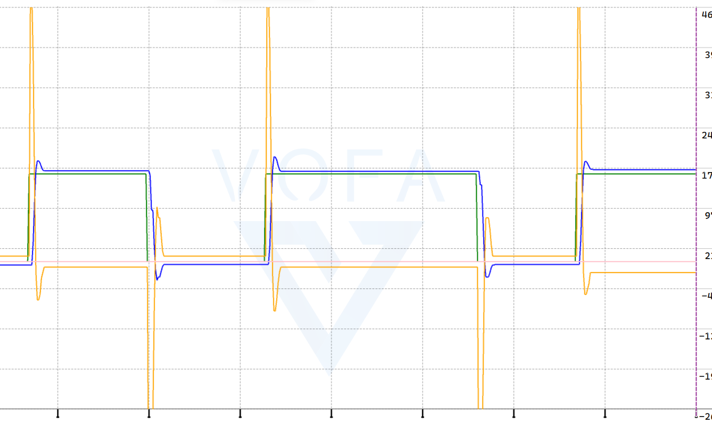

## 2. `Kd`调节

==**`Kd`使用微分先行的方法,防止突变的瞬间大值**==

**调节方法:Kd主管刹车,所以使得PD器刹车到接近目标值即可,这个时候尽量不要出现超调现象,即使出现了也只能容忍一丢丢**

开始加入Kd:Kd越大,刹车越明显,延迟也很明显

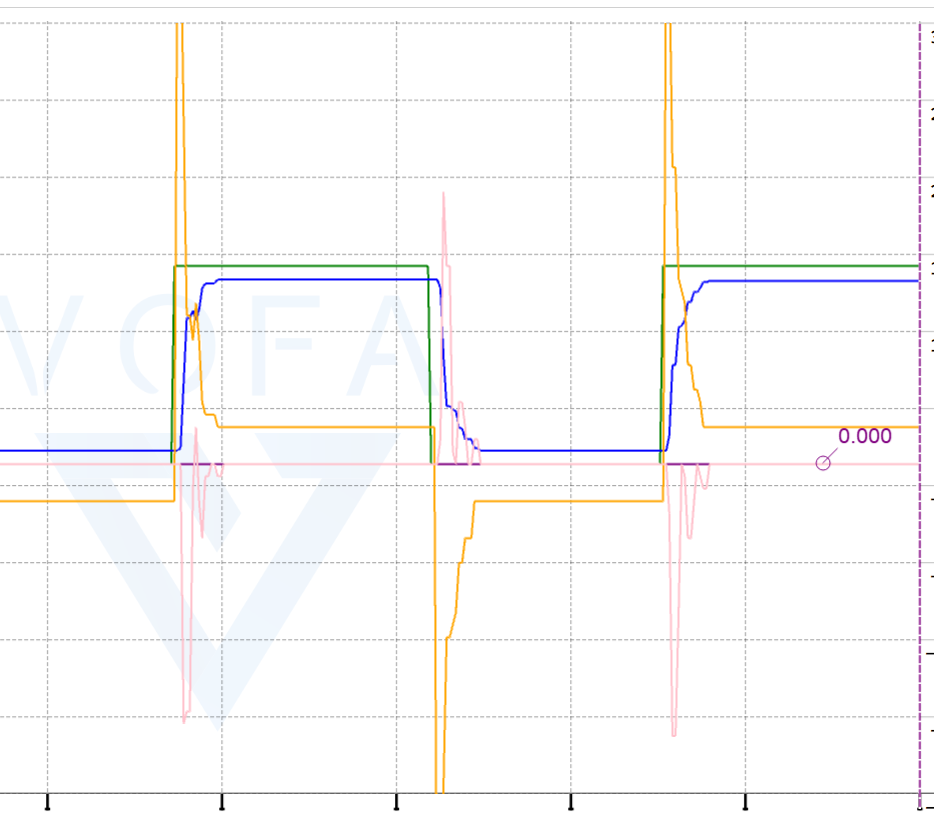

值得注意的是,Kd越大,抖动越明显,上图的粉色线可以看出来抖动很明显,但是降低Kd,抖动明显少了,Kd取0.15

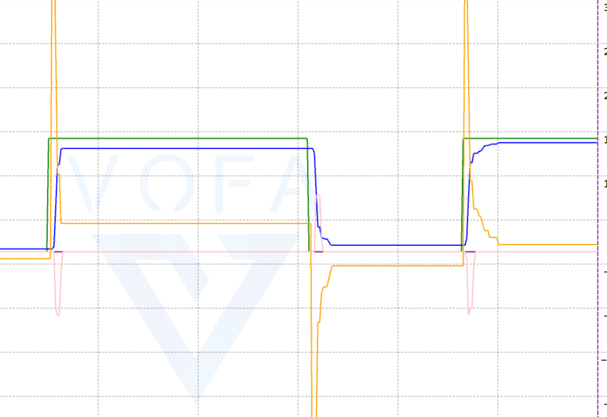

截至目前,得到了Kp和Ki的两个不错的值,现在就需要消除稳态误差了:马上开始调节Ki

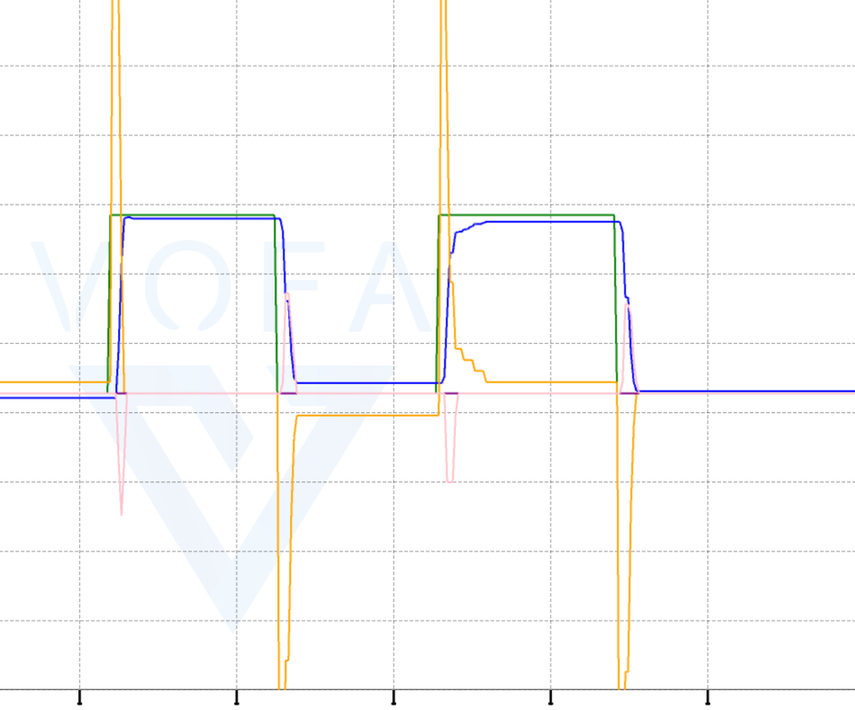

## 3. `Ki`调节

### 3-1 `Ki`过大

Ki过大,会导致超调严重(紫色为Ki的输出)

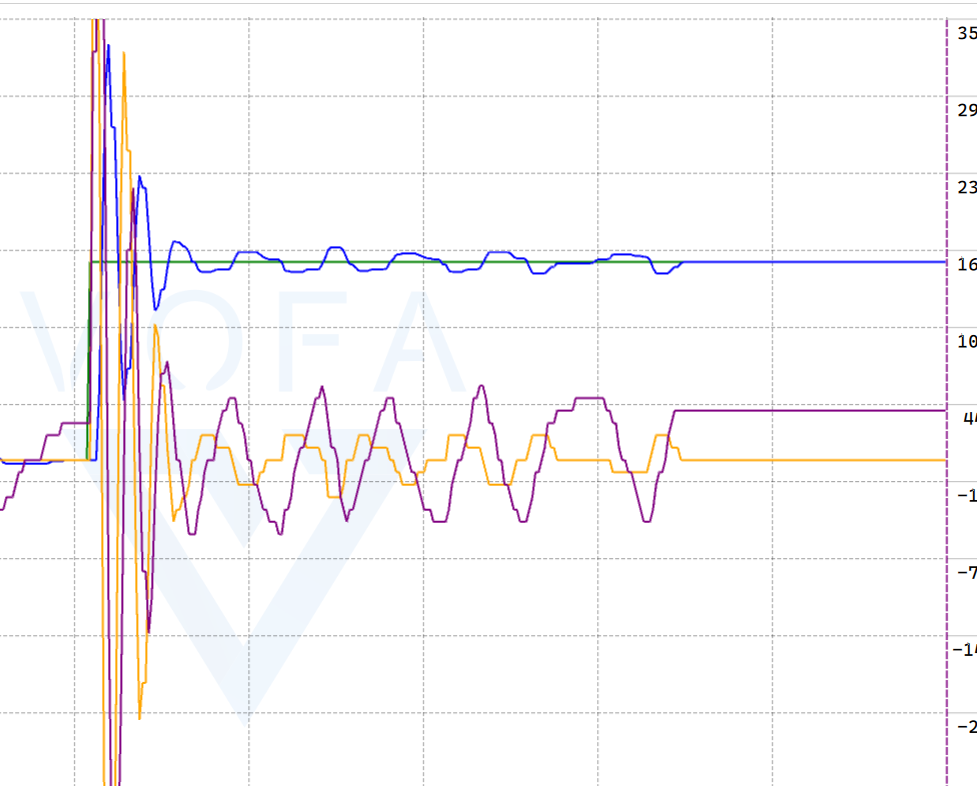

### 3-2 `Ki`小范围取值

所以调小Ki,但是遇到了新的问题,即重新出现超调,并且稳态恢复慢

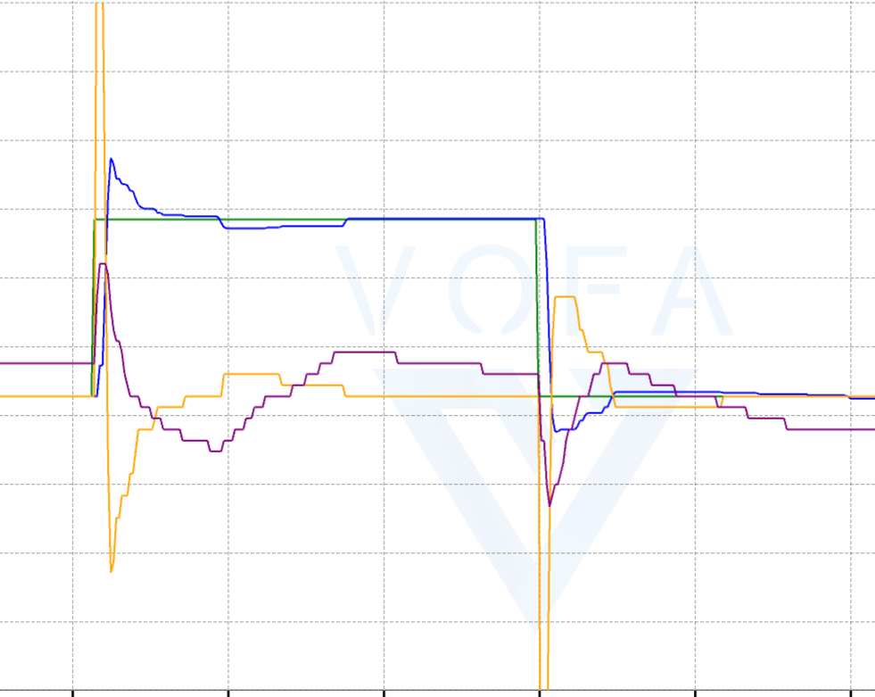

**防止超调重新出现需要减小Ki,加快稳态调控需要增大Ki,所以考虑变速积分**

那么就需要得到变速积分的相关函数图像,再得到相关参数

首先测定Ki的取值区间(防抖动,超调小,回稳态不慢即可)

* Ki = 0.03:超调一般,回稳态慢

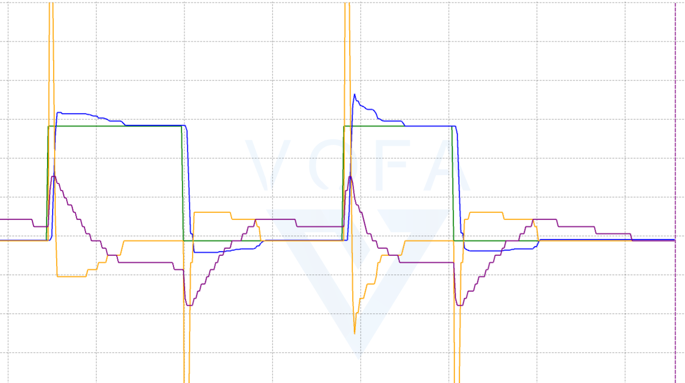

* Ki = 0.06:超调大,回稳态快

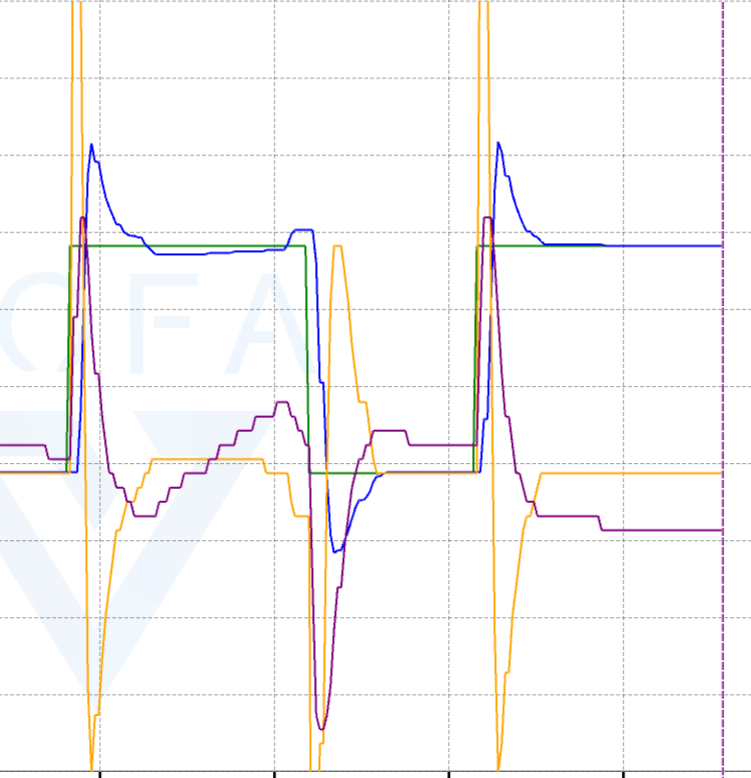

* Ki = 0.09:超调更大,回稳也不稳定了,抖动多

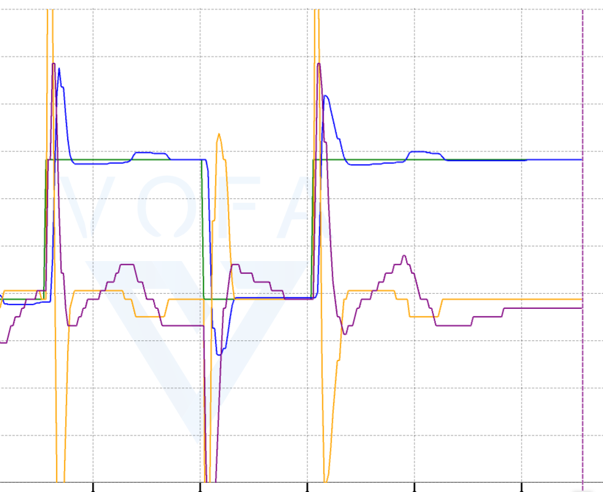

所以选定Ki在0.03到0.09之间

​	通过测试(观察上面的KD调试器),发现最后KD调节的稳态误差在20以内,所以**误差阈值选为20**即可

​	对于超调,可以让误差大时系数小,甚至为0,导致Ki对超调的影响小,而原本KD器超调本来就被调的很小(油门+提前刹车),所以在误差大时可以让系数C为0

**Ki的初始值可以设为0.3**,这样虽然回稳态慢,但是对超调的影响小,即使后来系数C在误差大时不为0,也能因为Ki小而抑制超调

​	对于回稳,由于0.03-0.06效果不错,并且误差越小越需要调,不如直接设置一个一次函数:**C = -0.05 * 误差绝对值 + 2** ,当误差等于20,C刚好等于1,所以误差小于20时,C变大,使得Ki * C变大,对于稳态误差的调节就更灵敏并且由于C最大为2,所以Ki * C最大也就是0.06,根据0.06的图片知,不至于出现稳态调节抖动(来回跑,如上图0.09)

* 得到当前效果:

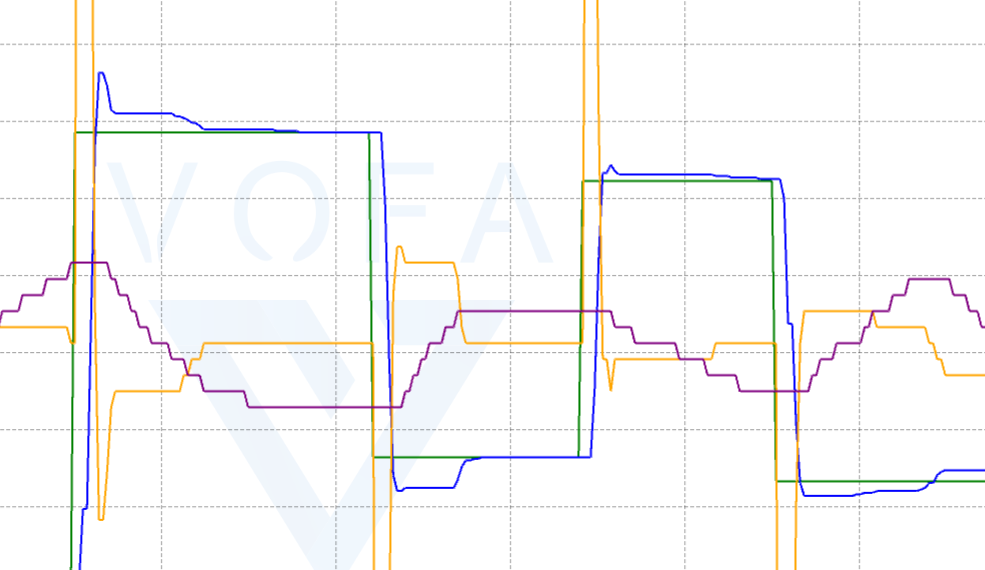

​	发现超调严重,原因就在于积分累积影响了调控,导致超调,所以可以设置积分分离,在积分阈值内,PD器无动于衷,但是积分项发挥作用,在积分阈值外,PD器自己可以干,不需要积分器,刚刚好,十分舒服

​	所以添加积分分离:

```c
// 积分分离
if (fabs(pid->PreError) < 20)	// 测出来的PD器稳态误差的包络值
{
  // 什么都不干
}
else
{	
  pid->SumError = 0 ;	// 清零积分器,防止干扰整体调控(其实也就是PD器在作为主力加油时不需要积分器也来加油,否则很容易引起超调)
}
```

* 效果:(微小超调不必理会,毕竟位置变化这么大,稳态调节这么快,一点超调又何妨)

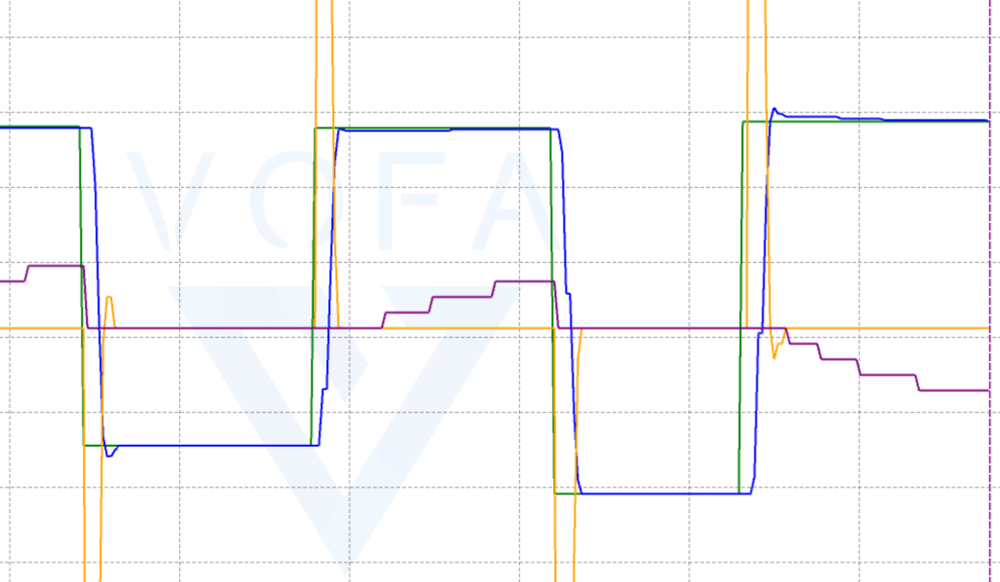

调节方法:

* 首先得到PD器的稳态误差区间,得到**稳态误差包络值**

* 其次开始调节`Ki`,得到**超调小稳态慢**到**超调大稳态快**的区间,**取前者作为基础Ki**(后者也行,看项目要求,如果是对角度要求高那就稳态越快越好,选择后者,如果对幅度要求高那就取前者,这里取前者)
* 开始构造系数C的参数函数`fx`:在大于稳态误差阈值时C要很小才好(PD作为主力即可),在小于稳态误差阈值时`Ki`进场发挥作用,选择C的max值和1作为两个端点,**自己构造函数**
* 最后就是积分分离,也是防止`Ki`干扰PD器(还没有达到稳态阈值时)导致超调,所以进行判断,大于稳态误差时累次积分为0即可,这样就实现了分离!
* 完毕


总代码:

```c
float PID_Cal(Pid_Typedef *pid, float ActualValue , float OutputMin , float OutputMax)
{
	// 更新上次误差
	pid->LastError = pid->PreError;
	// 得到本次误差
	pid->PreError = pid->goalPoint - ActualValue;
	// 微分误差
	pid->dError = pid->PreError - pid->LastError;
    // 得到本次和上次实际值(更新)
	pid->ActualPoint_Before = pid->ActualPoint_Now ;
	pid->ActualPoint_Now = ActualValue ;
    
	// 积分累加:变速积分
	C = fx(fabs(pid->PreError)) ;	// a的值自己测
	// 积分累加:积分分离
	if (fabs(pid->PreError) >= 20)
	{
		pid->SumError = 0 ;
	}
	// 积分累加:
	pid->SumError += C * pid->PreError;
    
	// 积分限幅
	if (pid->SumError > SumError_MAX)
	{
		pid->SumError = SumError_MAX ;
	}
	else if (pid->SumError < -SumError_MAX)
	{
		pid->SumError = -SumError_MAX ;
	}
	
	// 输出参数
	P_Out = pid->Kp * pid->PreError ;
	I_Out = pid->Ki * pid->SumError ;
	D_Out = pid->Kd * pid->dError   ;
	
	// 微分先行
	D_Out = pid->Kd * (  D_a * pid->dError  - (1-D_a) * (pid->ActualPoint_Now - pid->ActualPoint_Before ) );
	
	// 数据采集
	check[0] = P_Out ;
	check[1] = I_Out ;
	check[2] = D_Out ;
    
	// 输出值
	float Output = P_Out + I_Out + D_Out ;	
	
	// 输出限幅-PWM的ARR
	if ( Output > OutputMax ) { Output = OutputMax ; }
	if ( Output < OutputMin ) { Output = OutputMin ; }
	
	return Output ;	// 新的设定值
}
```

