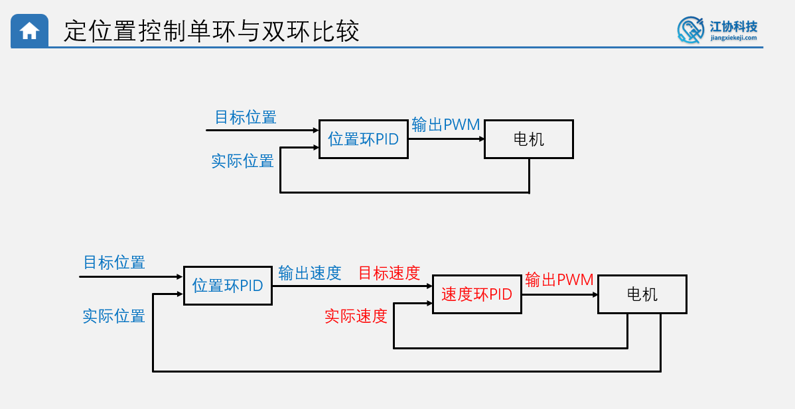

# 双环PID

分为外环和内环

外环为主体,内环为辅助

拿旋转环来说:

​	外环为角度环,内环为速度环,那么外环的goal就是期许的角度,外环的output就是为了达到期待的角度所需要的速度,内环速度环由于是内环,所以输入值是goal,输出值可以看做期待实现goal的输出速度,所以当其输入接收为外环角度期许的速度时,其输出为调控后的期许速度,更加准确(**说人话:原本外环期许的速度就是纯PWM,也不知道能跑到哪里去,但是加入了内环,那么将内环速度环可以看成是理想速度器,要什么速度就给什么PWM,输出的就是真实速度,所以加入内环之后输出的速度不再是简单的PWM了,而是能够实现goal的PWM**)



程序伪代码:

* 定时器中断回调:

```c
if (count_sys % 40 == 0)
{
    speed  = Encoder_Get() ;	// 得到速度(多少脉冲/40ms)
    position += speed ;			// 得到角度(多少脉冲)
    // 速度环-内环,改变速度,作为内环,速度环可以包装为一个理想速度器,由角度环外环调用,角度调节更加精准
    PID_Update(&PID_s , speed) ;
    // 角度环-外环,调用理想速度环实现角度控制
    PID_Update(&PID_p , position) ;
    // 环的串行连接:(关键)
    PID_s.goalPoint = PID_p.Output ;
}
```

* while

```c
// 电机速度输出
// 使用的是速度环的输出,毕竟速度环的goal是角度环的output,所以速度环的output就成为了理想的速度
Motor_SetPWM(PID_s.Output) ;

```


