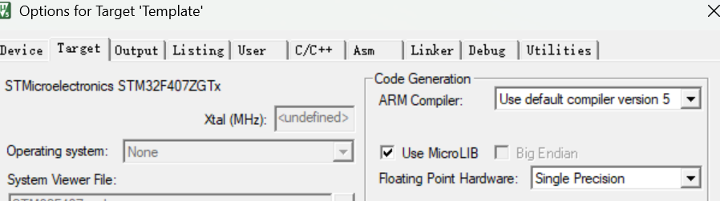
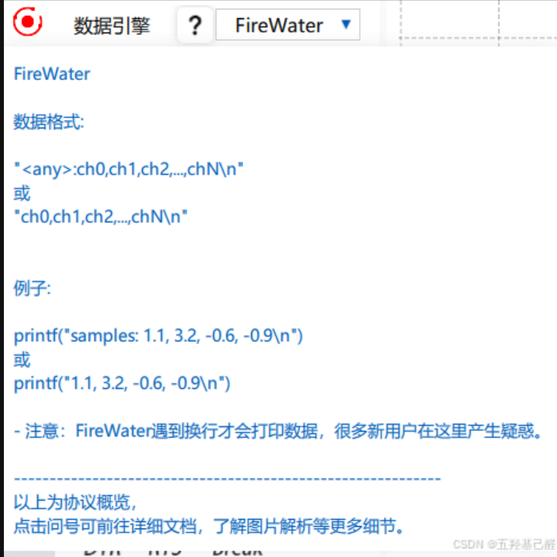
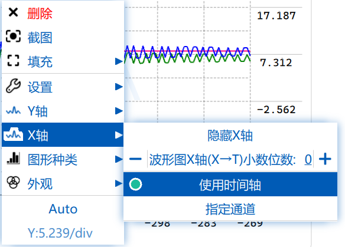

# VOFA+

## 1. 串口重定向

**参考资料:**

* [printf函数重定向](https://blog.csdn.net/weixin_55686654/article/details/132745884?ops_request_misc=%7B%22request%5Fid%22%3A%2282aeae5538a8d22572f7ab00237ac722%22%2C%22scm%22%3A%2220140713.130102334..%22%7D&request_id=82aeae5538a8d22572f7ab00237ac722&biz_id=0&utm_medium=distribute.pc_search_result.none-task-blog-2~all~top_positive~default-1-132745884-null-null.142^v102^control&utm_term=stm32 printf重定向 hal&spm=1018.2226.3001.4187)

* 在`uasrt.c`中:

```c
/* USER CODE BEGIN 0 */
// 新增重定向
#include <stdio.h>
 
 #ifdef __GNUC__
     #define PUTCHAR_PROTOTYPE int _io_putchar(int ch)
 #else
     #define PUTCHAR_PROTOTYPE int fputc(int ch, FILE *f)
 #endif /* __GNUC__*/
 
 /******************************************************************
     *@brief  Retargets the C library printf  function to the USART.
     *@param  None
     *@retval None
 ******************************************************************/
 PUTCHAR_PROTOTYPE
 {
     HAL_UART_Transmit(&huart1, (uint8_t *)&ch,1,0xFFFF);
     return ch;
 }
/* USER CODE END 0 */
```

* 在`main.h`中

```c
/* USER CODE BEGIN Includes */
 #include <stdio.h>
/* USER CODE END Includes */
```

* 在魔术棒模式:

​	**使用MicroLIB**


* 这样就能使用 `printf` 了​ :smile:

或者:简单方法:

* 在main.c中使用:

```c
// 串口printf重定向*
int fputc(int ch , FILE *f)
{
	Serial_SendByte(ch) ;
	return ch ;
}
```

* 

​	**即可**

## 2. ==打印数据需要尾部加上**\n**==



## 3. PID调节(简)

**参考资料:**

* [电工基地 : 使用VOFA+进行PID调试](https://blog.csdn.net/u014483560/article/details/128667034?ops_request_misc=&request_id=&biz_id=102&utm_term=vofa PID使用教程&utm_medium=distribute.pc_search_result.none-task-blog-2~all~sobaiduweb~default-0-128667034.142^v102^control&spm=1018.2226.3001.4187)

1. 稳定输出PID的数据(要知道自己要看的是`point`而不是`pid`)

​	`printf("%f,%f,%f\n" ,goalPoint , setPoint , realPoint) ;`

2. VOFA自己会显示数据的数字,但是显示需要自己开:

* Y轴显示数据轴


* X轴显示时间轴



* 数据显示使用Auto

