[toc]

# 1. Github basic

## 1-1 建立仓库

### 1-1-1 远端建立一个仓库

* 配置为public + readme等基本的形式就行了
* 协议:MIT即可

### 1-1-2 远端仓库部署到本地

* 本地建立一个文件夹,进入文件夹
* 去远端得到工程的SSH
* 本地文件夹`git clone <SSH>`,即部署完成

### 1-1-3 部署 Vscode 

* 右键用vscode打开即可完成vscode部署

### 1-1-4 部署IDEA

* 右键用IDEA打开即可完成部署,记得ignore`idea`(其实没事,工程ignore已经有了)

## 1-2 基础操作

### 1-2-1 加入文件

* 直接本地加入即可,然后在vscode进行推送,单个文件不要大于100M

### 1-2-2 **配置.gitignore**

* 已经有了现成的,可以直接复制粘贴到**.git同级文件夹**,不用再重复配置了
* **若已经有文件在远端,这说明它已经被git跟踪了**,所以需要:
  * 先配置.ignore
  * 再拷贝一份(如果有必要)
  * 去云端删掉或者本地**`git rm + <文件名>`** : 删除一个文件之后告诉 git 不需要再管理这个文件了

### 1-2-3 一般工作情况

* 进行文件的修改:
  * 进行文件编辑前先pull一下
  * 修改文件(可以修改一部分然后提交,这样好撤回)
  * 总体提交即可

## 1-3 分支操作

### 1-3-1 本地创建分支

* Vscode:
  * 在相应的流程图右键即可,远端分支也就随push而建立
* IDEA:
  * 在Local的相应分支下右键即可,远端分支也就随push而建立

### 1-3-2 切换分支

* Vscode:左下角

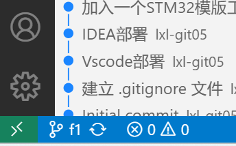

* IDEA:右键分支`checkout`
* git :`git switch <分支名称>`

### 1-3-3 删除本地及远端分支

* Vscode:
  * 先切换到不需要删除的分支
  * 然后点击"分支",选择删除远端分支和本地分支即可

* IDEA:
  * 先切换到不需要删除的分支
  * 右键想要删除的分支,delete即可

### 1-3-4 分支Merge

* 解释(我老是搞反):**A Merge (==into==) B : A同步到B,即A分支保存没变,B分支迭代一次变为C**

* Vscode : 

  * 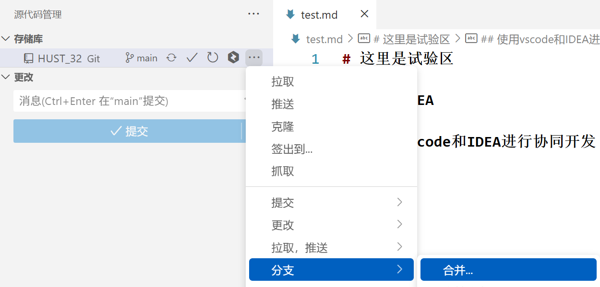

  *  ==这里是说合并进来(也就是说当前是main,那么f1是合并进来的)==

* IDAE:
  * 先选择需要merge的分支作为当前分支(如feature1)
  * 再右键需要 merge into 的分支进行合并即可,很方便
  * 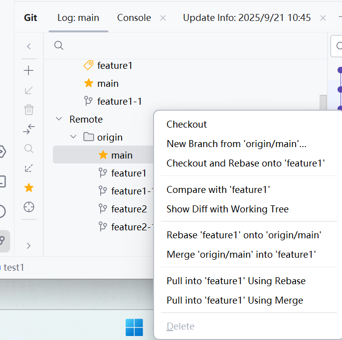

### 1-3-5 解决本地分支合并冲突

* 方法:merge解决冲突
  * 解决方法在上面呢

### 1-3-6 解决本地远端分支冲突

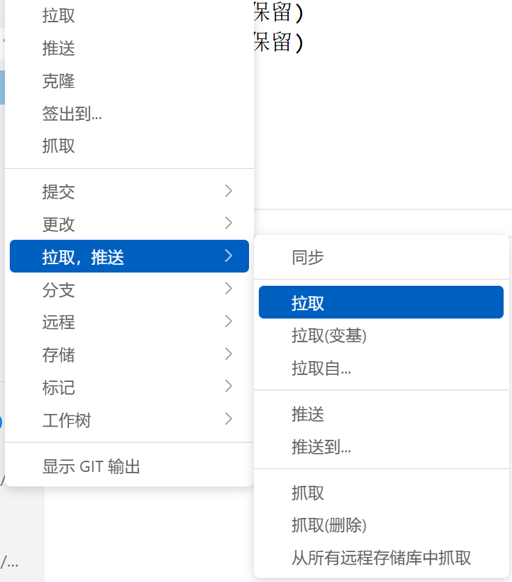

* 方法1:merge
  * 本地操作了,远端也操作了,产生冲突
  * 拒绝本地push,要求pull,此时可以`git pull`然后开始解决冲突,也可以点击同步按键开始解决冲突
  * 或者直接按键按下拉取
* 方法2:rebase
  * 本地操作了,远端也操作了,产生冲突
  * 直接点击拉取(**变基**,即可)

### 1-3-6 回溯操作

* vscode : 
  * `git reset --<操作> + ID`
    * `git reset --mixed + ID`
      * 回溯的操作保存在暂存区
    * `git reset --hard + ID`
      * 这意味着将本地的进程回退到ID序列的位置,并且将这之前的所有修改撤回(不保留在工作区),所以此时先前所有的操作都丢了
      * 本地回溯之后会显示落后于远端,这时可以使用强制推送`git push origin main --force`==慎用,丢了的东西再也回不来了==

* IDEA:
  * 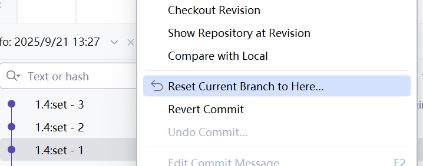

## 1-4 四种后悔药

### 1-4-1 撤销已上传节点:reset回溯

* ==要点:想要回到某一次状态(含该状态更改),**需要回溯到该次状态前一次哦**,那么该状态(如果是mixed)的改动就会留在工作目录==

* 实现回溯之后会出现本地落后远端的情况,已知想要的就是回溯到该状态**,安全的解决方法**是:
  * 先pull
  * 再建立一个分支
  * 再reset回溯 +   ` git push --force origin 分支名(慎用)`

| **git 命令**                 | **效果**                                                     | **备注**               |
| ---------------------------- | ------------------------------------------------------------ | ---------------------- |
| `git reset --soft <commit>`  | 撤回提交，撤回的更改保留在暂存区和工作目录                   | 较少使用               |
| `git reset --mixed <commit>` | ==撤回提交与暂存区，撤回的更改保留在工作目录==               | ==默认方式，推荐使用== |
| `git reset --hard <commit>`  | 撤回提交、暂存区和工作目录，不保留任何更改                   | 危险！会丢失未提交内容 |
| `git reset --keep <commit>`  | 撤回提交与暂存区，未提交的改动保留在工作目录（冲突时会报错） | 较少使用               |

* vscode :
  * 没有图形化界面,使用git
    * git reset --<操作> ID
* IDEA:
  * 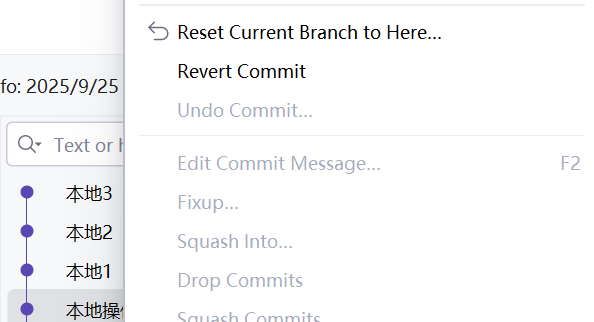

### 1-4-2 撤销暂存区:rollback撤销本地暂存区操作

* 加入暂存区但是没有上传可以使用
* vscode:
  * 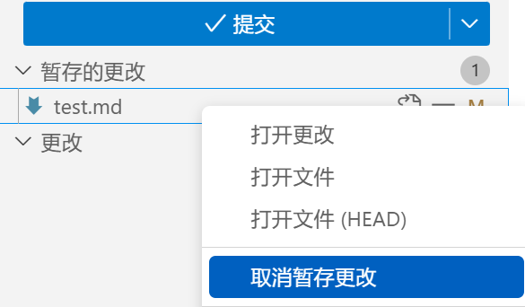

* IDEA:
  * 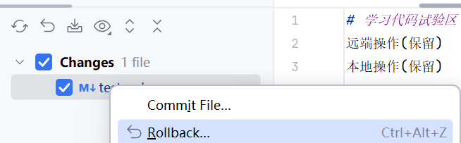

### 1-4-3 撤销某个已上传节点:revert撤销某次结点(最安全的方法)

​	在 GitHub 中，**Revert**（撤销）是一个用于 **安全地撤销已提交的更改** 的功能，它通过创建一个 **新的提交** 来抵消历史提交的影响，而不是直接删除或修改历史提交。这是 GitHub（及 Git）中保护协作历史的重要机制,**简单来说就是将某一次更改的结果取消,其他所有的东西保持不变,该结果作为一次新的提交**

* vscode:
  * 没有图形化界面,只能使用git命令:
    * git log 查看往期改动,选择想要改动的版本号
    * git revert ID

* IDEA:
  * 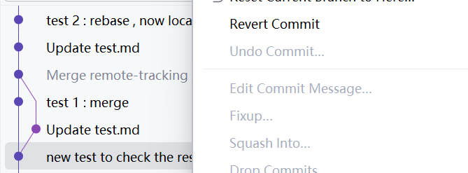

### 1-4-4 撤销待上传节点:amend(修改已经commit了的最近一次更改)

* 当完成一次改动并且add & commit了,这时需要修改该节点,就可以使用amend:

* vscode:
  * 已知改动已经add & commit 
  * 修改相关改动
  * add 相关改动
  * `git commit --amend -m"本次更改解释"`    /    `git commit --amend --no-edit`(不修改相关解释)

* IDEA:

  * 已知改动已经add & commit 
  * 修改相关改动
  * 然后这么操作:
  * 勾选changes / 勾选Amend(代表修改本次更改) / Amend Commit即可

  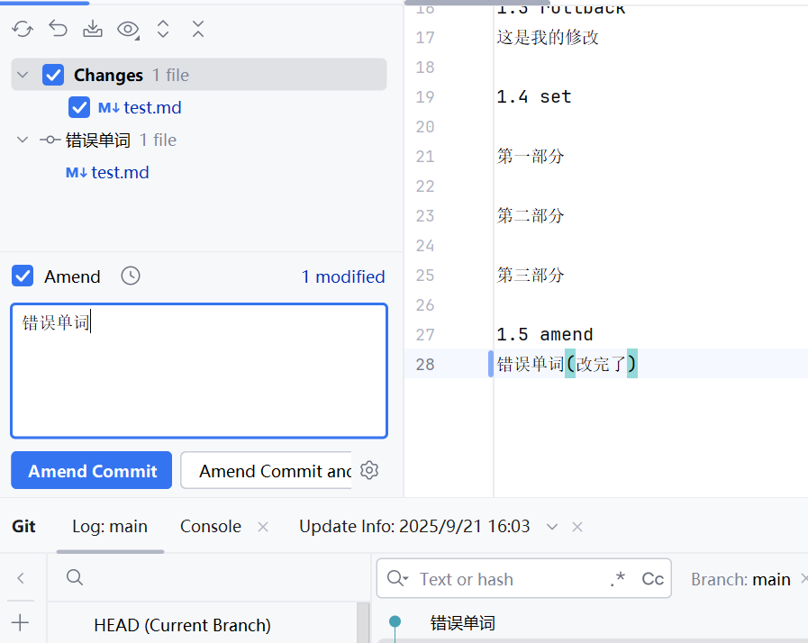

## 1-5 其他操作

### 1-5-1 Squash-合并未上传分支

* VScode:

​	待编辑,累了

* IDEA:

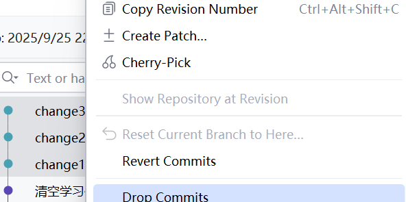

### 1-5-2 Cherry pick-将一个分支的部分改动加入到另一个分支(调为当前分支)的部分改动去

* IDEA:

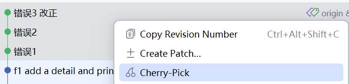

### 1-5-3 Stash & shelve(IDEA都有)

* **Stash**:当前产生了一个更改,但是我有别的事情,所以必须先去别的分支,那么这个时候可以使用Stash暂存一下当前更改,使它不会消失,到时候再拿出来即可

  * Vscode:
    * 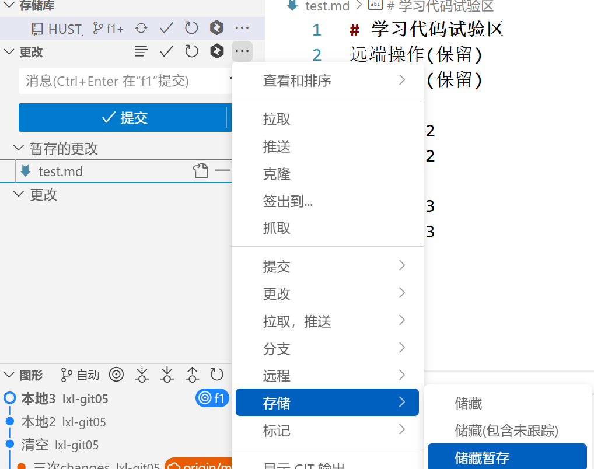

  * IDEA:
    * 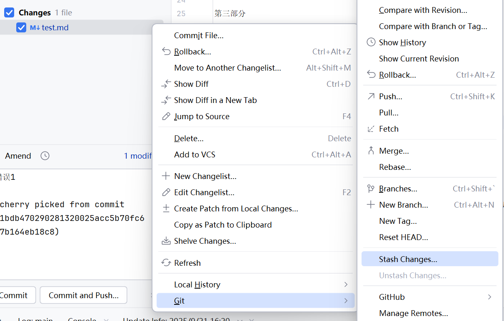

* **Shelve**:
  * 这是IDE自己开发的模式,也就是只选择一部分从当前操作中保存,其余操作丢弃
  * 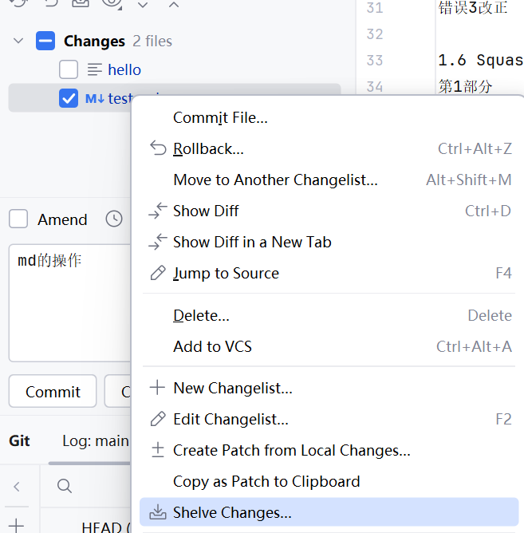

### 1-5-4 git blame - 查看节点详细信息

* 看是谁写的代码

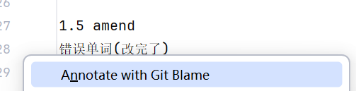

* 看看改动情况

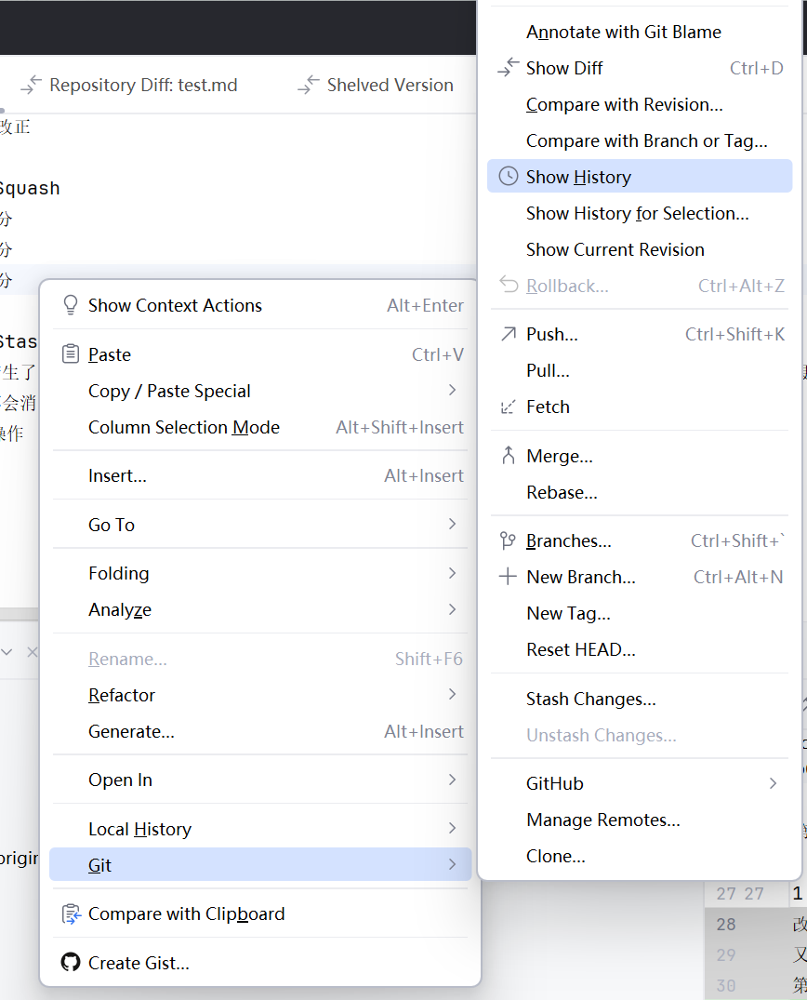

### 1-5-5 Compare - 比较不同

​	也就是比较两个东西的不同点

* 例1:分支比较

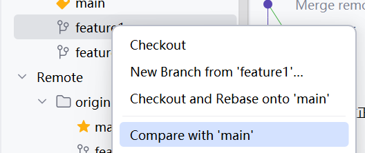

* 例2:结点比较

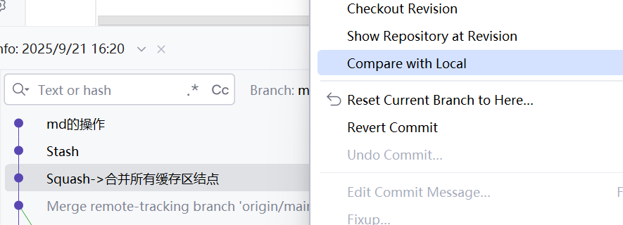