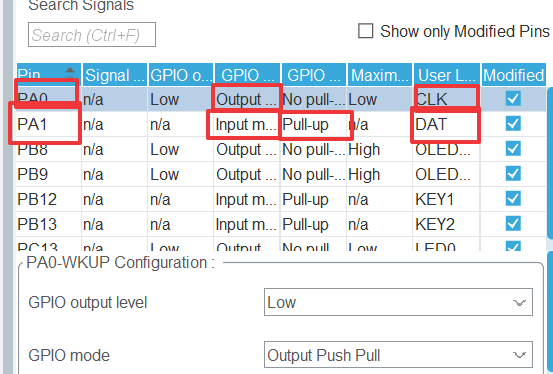

# 8路寻迹+MSPM0L1306辅助板使用教程

## 辅助板功能简介

辅助板搭载MSPM0L1306芯片，核心功能为

- **信号处理**：自动读取8路灰度传感器模拟信号并转换为数字量，每路输出0/1（白/黑）
- **一键校准**：通过板载按键一键记录黑白基准值，自动计算判定阈值，数据保存于Flash
- **串行输出**：通过CLK+DAT同步串行协议将8路数据输出，主控仅需2个GPIO即可读取
- **错误检测**：ERR指示灯提示传感器过曝或异常

主控只需发送时钟信号，即可同步读取8路数字量，无需ADC、无需切换通道，极大节省IO资源。

## 硬件接线

| 辅助板          | stm32f103 |
| --------------- | --------- |
| GND             | GND       |
| VCC             | VCC       |
| CLK(时钟输入)   | PA0       |
| DAT（数据输出） | PA1       |

## CUBEMX配置

基于模板工程

只需要配两个GPIO口作为接收串行输入输出的数据（PA0可换成一个定时器引脚生成时钟信号）



## 核心代码

### 读取函数

```c
uint8_t Read_Sensor_Data(void)
{
    uint8_t data = 0;
    HAL_GPIO_WritePin(CLK_PORT, CLK_PIN, GPIO_PIN_RESET);
    delay_us(5);
    for (int i = 0; i < 8; i++) {
        HAL_GPIO_WritePin(CLK_PORT, CLK_PIN, GPIO_PIN_SET);
        delay_us(5);
        HAL_GPIO_WritePin(CLK_PORT, CLK_PIN, GPIO_PIN_RESET);
        delay_us(5);//产生时钟信号，如果有空闲定时器最好用定时器
        if (HAL_GPIO_ReadPin(DAT_PORT, DAT_PIN)) data |= (1 << i);
    }
    return data;
}
```

### 主函数

```c
/* USER CODE BEGIN 3 */
		
		Digtal = Read_Sensor_Data();
    
    printf("Digtal = 0x%02X", Digtal);
    
  
    printf(" | ");
    for (int i = 7; i >= 0; i--)
    {
        printf("%d", (Digtal >> i) & 0x01);
    }
    printf(" \r\n"); 
    HAL_Delay(1000); //这里延时较长是方便调试，实际工作延时肯定不能这么长  
	}
  /* USER CODE END 3 */
```

### 结果

串口会输出格式如0x01|00000001的结果，后面就是每一路识别的代的信号，前面就是可以用来处理的结果

## 寻迹模块校准方式

长按辅助板上的按键进入快闪状态后可以松手进入慢闪状态说明进入校准模式，然后对准白色基准长按进入快闪，一直按着当再次进入慢闪说明校准白色完成可以松手，黑色同理然后就校准结束，注意没有校准的话串口会一直返回0x00|00000000

