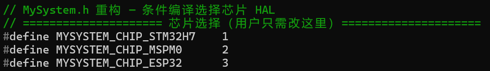

# 1. MySystem重构

+ 2026/7/4

现在你处于我的模板工程里面，我还在进行修改，目前最需要干的就是MySystem,我需要建立一个最底层的驱动，使得无论换哪一个芯片，无论是TI的MSPM0还是STM32还是ESP32，都只需要修改MySystem即可，剩下的业务逻辑完全不需要更改，可以直接使用，现在你查看我的整个代码工程，先分析结构，然后提出MySystem的修改建议，以及其他System的加入建议，比如Encoder软件驱动、USART串口常用配置等，其他的业务逻辑倒是可以后面再改，后续只在Mode_2进行测试

+++

不认可：

1. 我觉得芯片选择不需要使用

 #define MYSYSTEM_CHIP_STM32H7    1
 #define MYSYSTEM_CHIP_MSPM0      2
 #define MYSYSTEM_CHIP_ESP32      3

结构，而是由用户自己选择相关的include、芯片参数，你只需要通过注释重点标注芯片移植需要修改哪些参数即可

2. 我觉得宏定义还是不太好，首先比如

 #define MyPWM_Servo1_TIM   &htim1
 #define MyPWM_Servo1_CH    TIM_CHANNEL_1
 #define MyPWM_Servo1_ARR   1000

在别的芯片可能不叫这个，使得其他芯片还需要删除某些宏，新增某些宏，并不方便，我们可以讨论一下使用宏定义（其实也比较分散）还是宏表，还是结构体表（表内列了用户自己注册的引脚等）

3. 你重新plan一下

+++

一次要你思考整体架构比较耗费时间和精力，首先我们集中精力解决MySystem和GPIO两个库

1. GPIO给出你的方案
2. 每次你给出了方案都必须给简单的实例代码
3. 给出plan

+++

1. 我认可在Mysystem.c里面注册所有的引脚和后面其他模块的配置，不仅更加紧凑，而且表的使用也是更加紧凑
2. 

  const MyGPIO_Typedef MyGPIO_LED0        = { LED0_GPIO_Port,    LED0_Pin };
  const MyGPIO_Typedef MyGPIO_Key0        = { KEY0_GPIO_Port,    KEY0_Pin };
  const MyGPIO_Typedef MyGPIO_Key1        = { KEY1_GPIO_Port,    KEY1_Pin };
  const MyGPIO_Typedef MyGPIO_Key2        = { KEY2_GPIO_Port,    KEY2_Pin };
  const MyGPIO_Typedef MyGPIO_OLED_SCL    = { OLED_SCL_GPIO_Port, OLED_SCL_Pin };
  const MyGPIO_Typedef MyGPIO_OLED_SDA    = { OLED_SDA_GPIO_Port, OLED_SDA_Pin };
  const MyGPIO_Typedef MyGPIO_Motor_A_IN1 = { Motor_A_IN1_GPIO_Port, Motor_A_IN1_Pin };
  const MyGPIO_Typedef MyGPIO_Motor_A_IN2 = { Motor_A_IN2_GPIO_Port, Motor_A_IN2_Pin };
  const MyGPIO_Typedef MyGPIO_Motor_B_IN1 = { Motor_B_IN1_GPIO_Port, Motor_B_IN1_Pin };
  const MyGPIO_Typedef MyGPIO_Motor_B_IN2 = { Motor_B_IN2_GPIO_Port, Motor_B_IN2_Pin };

和GPIO表有什么关系呢，还有为什么需要取名字呢

+++

那么现在开始修改PWM的配置吧，还是先进行计划

+++

  1. MyPWM.h — 增强结构体 + 接口：

    typedef struct {
      TIM_HandleTypeDef *htimx;   // TIM外设句柄
      uint32_t Channel;           // 通道号
      float PWM_MAX;              // ARR最大值（决定分辨率）
      uint32_t ARR;               // 当前ARR（运行时可读）
      uint32_t PSC;               // 当前PSC（运行时可读）
    } MyPWM_Typedef;

需要进行修改

1. PWM_MAX很明显是用来限幅的，你搞错了
2. 可以再加入一个PWM_MIN
3. 我没有修改频率的需求，相关函数可以简化
4. 重新给我plan方案

+++

既然如此，PSC也可以删除了，反正TIM_HandleTypeDef *htimx句柄足够了，你觉得呢，然后PWM_MAX和MIN你觉得需要改成更加直观的名字吗

+++

现在开始，你看看定时器文件有没有修改的必要，对于芯片底层移植来说

