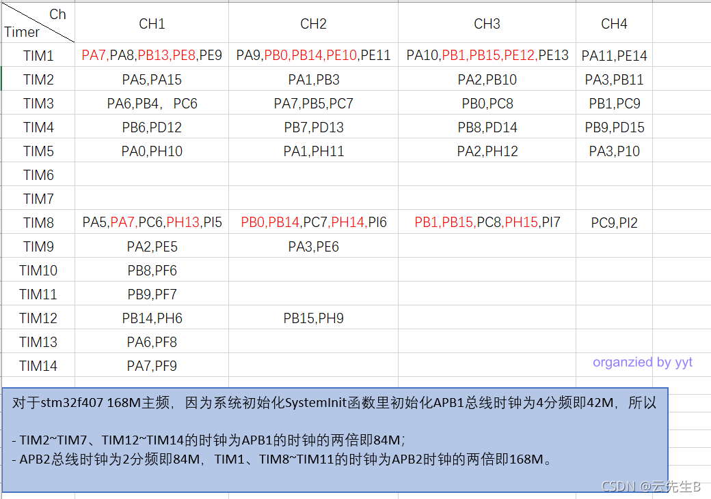
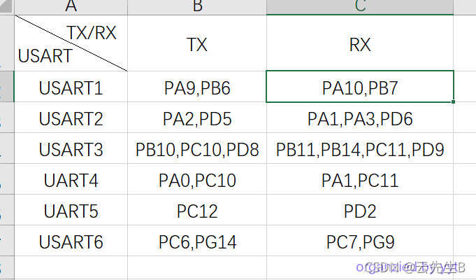
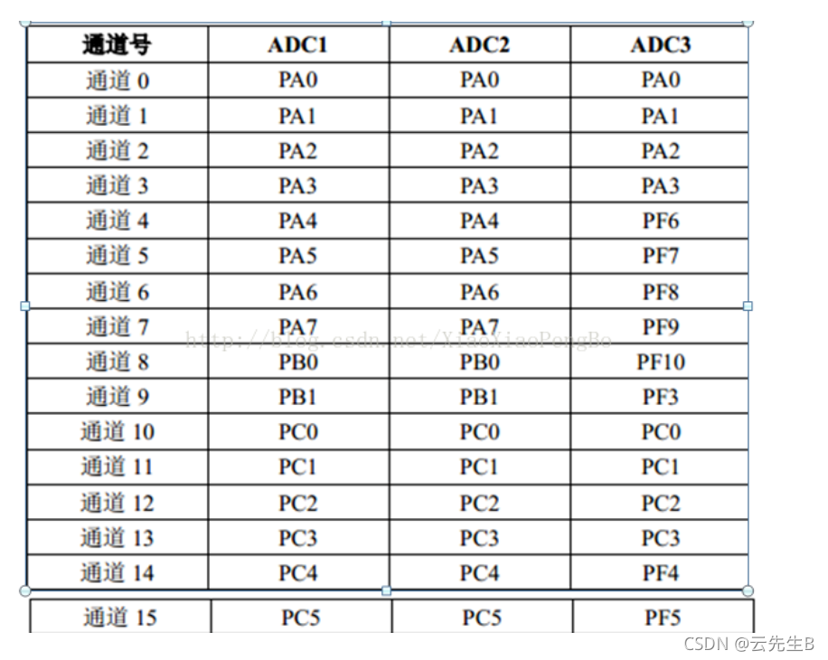
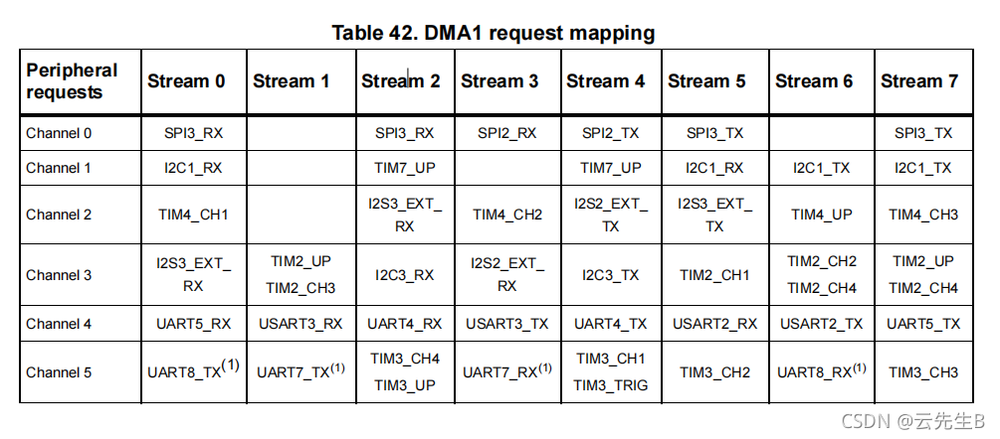
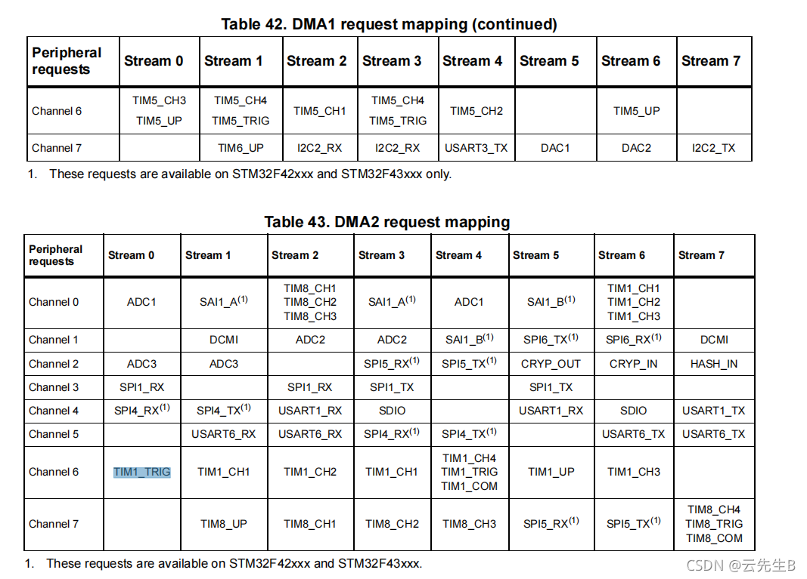

# 1. 板内资源分配

+ 参考资料：[【嵌入式 · STM32】STM32F407引脚复用对照表_stm32f407引脚图及引脚定义-CSDN博客](https://blog.csdn.net/qq_34802028/article/details/120210944?ops_request_misc=elastic_search_misc&request_id=b11dc09d781d65cd247e2ecc87658dd3&biz_id=0&utm_medium=distribute.pc_search_result.none-task-blog-2~all~sobaiduend~default-2-120210944-null-null.142^v102^pc_search_result_base5&utm_term=stm32f407ZGT6引脚分布图&spm=1018.2226.3001.4187)

## 1-1 TIM

## 1-2 USART

## 1-3 ADC

## 1-4 DMA

# 2. 引脚资源分配

|      |          | STM32F407ZGT6 |                                                              |
| ---- | -------- | ------------- | ------------------------------------------------------------ |
| 引脚 | 引脚名称 | 主功能        | 默认复用                                                     |
| 1    | PE2      | PE2           | TRACECLK/ FSMC_A23 /ETH_MII_TXD3 /EVENTOUT                   |
| 2    | PE3      | PE3           | TRACED0/FSMC_A19 /EVENTOUT                                   |
| 3    | PE4      | PE4           | TRACED1/FSMC_A20 /DCMI_D4/ EVENTOUT                          |
| 4    | PE5      | PE5           | TRACED2 / FSMC_A21 /TIM9_CH1 / DCMI_D6 /EVENTOUT             |
| 5    | PE6      | PE6           | TRACED3 / FSMC_A22 /TIM9_CH2 / DCMI_D7 /EVENTOUT             |
| 6    | VBAT     | VBAT          | RTC供电引脚                                                  |
| 7    | PC13     | PC13          | RTC_OUT,RTC_TAMP1,RTC_TS                                     |
| 8    | PC14     | PC14          | OSC32_IN(PC14)                                               |
| 9    | PC15     | PC15          | OSC32_OUT(PC15)                                              |
| 10   | PF0      | PF0           | FSMC_A0 / I2C2_SDA /EVENTOUT                                 |
| 11   | PF1      | PF1           | FSMC_A1 / I2C2_SCL /EVENTOUT                                 |
| 12   | PF2      | PF2           | FSMC_A2 / I2C2_SMBA /EVENTOUT                                |
| 13   | PF3      | PF3           | PF3/FSMC_A3/EVENTOUT/ADC3_IN9                                |
| 14   | PF4      | PF4           | PF4/FSMC_A4/EVENTOUT/ADC3_IN14                               |
| 15   | PF5      | PF5           | PF5/FSMC_A5/EVENTOUT/ADC3_IN15                               |
| 16   | VSS      | VSS           |                                                              |
| 17   | VDD      | VDD           |                                                              |
| 18   | PF6      | PF6           | TIM10_CH1 /FSMC_NIORD/EVENTOUT/ADC3_IN4                      |
| 19   | PF7      | PF7           | PF7/TIM11_CH1/FSMC_NREG/EVENTOUT/ADC3_IN5                    |
| 20   | PF8      | PF8           | PF8/TIM13_CH1 /FSMC_NIOWR/EVENTOUT/ADC3_IN6                  |
| 21   | PF9      | PF9           | PF9/TIM14_CH1 / FSMC_CD/EVENTOUT/ADC3_IN7                    |
| 22   | PF10     | PF10          | PF10/FSMC_INTR/ EVENTOUT /ADC3_IN8                           |
| 23   | PH0      | PH0           | OSC_IN(PH0)                                                  |
| 24   | PH1      | PH1           | OSC_OUT(PH1)                                                 |
| 25   | NRST     | 复位          |                                                              |
| 26   | PC0      | PC0           | OTG_HS_ULPI_STP/EVENTOUT /ADC123_IN10                        |
| 27   | PC1      | PC1           | PC1 / ETH_MDC/ EVENTOUT /ADC123_IN11                         |
| 28   | PC2      | PC2           | PC2 /SPI2_MISO /OTG_HS_ULPI_DIR /ETH_MII_TXD2/I2S2ext_SD/ EVENTOUT/ADC123_IN12 |
| 29   | PC3      | PC3           | PC3 /SPI2_MOSI / I2S2_SD /OTG_HS_ULPI_NXT /ETH_MII_TX_CLK/EVENTOUT/ADC123_IN13 |
| 30   | VDD      |               |                                                              |
| 31   | VSSA     |               |                                                              |
| 32   | VREF+    |               |                                                              |
| 33   | VDDA     |               |                                                              |
| 34   | PA0      | WKUP(PA0)     | USART2_CTS/UART4_TX/ETH_MII_CRS /TIM2_CH1_ETR/TIM5_CH1 / TIM8_ETR/EVENTOUT/ADC123_IN0/WKUP(4) |
| 35   | PA1      | PA1           | USART2_RTS /UART4_RX/ETH_RMII_REF_CLK /ETH_MII_RX_CLK /TIM5_CH2 / TIM2_CH2/EVENTOUT/ADC123_IN1 |
| 36   | PA2      | PA2           | USART2_TX/TIM5_CH3 /TIM9_CH1 / TIM2_CH3 /ETH_MDIO/ EVENTOUT/ADC123_IN2 |
| 37   | PA3      | PA3           | USART2_RX/TIM5_CH4 /TIM9_CH2 / TIM2_CH4 /OTG_HS_ULPI_D0 /ETH_MII_COL/EVENTOUT/ADC123_IN3 |
| 38   | VSS      |               |                                                              |
| 39   | VDD      |               |                                                              |
| 40   | PA4      | PA4           | SPI1_NSS / SPI3_NSS /USART2_CK /DCMI_HSYNC /OTG_HS_SOF/ I2S3_WS/EVENTOUT/ADC12_IN4/DAC_OUT1 |
| 41   | PA5      | PA5           | PA5/SPI1_SCK/OTG_HS_ULPI_CK /TIM2_CH1_ETR/TIM8_CH1N/ EVENTOUT/ADC12_IN5/DAC_OUT2 |
| 42   | PA6      | PA6           | PA6 /SPI1_MISO /TIM8_BKIN/TIM13_CH1 /DCMI_PIXCLK / TIM3_CH1/ TIM1_BKIN/ EVENTOUT/ADC12_IN6 |
| 43   | PA7      | PA7           | PA7/SPI1_MOSI/ TIM8_CH1N /TIM14_CH1/TIM3_CH2/ETH_MII_RX_DV /TIM1_CH1N /ETH_RMII_CRS_DV/EVENTOUT/ADC12_IN7 |
| 44   | PC4      | PC4           | ETH_RMII_RX_D0 /ETH_MII_RX_D0/EVENTOUT/ADC12_IN14            |
| 45   | PC5      | PC5           | PC5 /ETH_RMII_RX_D1 /ETH_MII_RX_D1/EVENTOUT/ADC12_IN15       |
| 46   | PB0      | PB0           | TIM3_CH3 / TIM8_CH2N/OTG_HS_ULPI_D1/ETH_MII_RXD2 /TIM1_CH2N/ EVENTOUT/ADC12_IN8 |
| 47   | PB1      | PB1           | TIM3_CH4 / TIM8_CH3N/OTG_HS_ULPI_D2/ETH_MII_RXD3 /TIM1_CH3N/ EVENTOUT/ADC12_IN9 |
| 48   | PB2      | BOOT1         |                                                              |
| 49   | PF11     | PF11          | DCMI_D12/ EVENTOUT                                           |
| 50   | PF12     | PF12          | FSMC_A6/ EVENTOUT                                            |
| 51   | VSS      |               |                                                              |
| 52   | VDD      |               |                                                              |
| 53   | PF13     | PF13          | FSMC_A7/ EVENTOUT                                            |
| 54   | PF14     | PF14          | PF14 / FSMC_A8/ EVENTOUT                                     |
| 55   | PF15     | PF15          | PF15 /FSMC_A9/ EVENTOUT                                      |
| 56   | PG0      | PG0           | FSMC_A10/ EVENTOUT                                           |
| 57   | PG1      | PG1           | PG1 / FSMC_A11/ EVENTOUT                                     |
| 58   | PE7      | PE7           | FSMC_D4/TIM1_ETR/EVENTOUT                                    |
| 59   | PE8      | PE8           | FSMC_D5/ TIM1_CH1N/EVENTOUT                                  |
| 60   | PE9      | PE9           | FSMC_D6/TIM1_CH1/EVENTOUT                                    |
| 61   | VSS      |               |                                                              |
| 62   | VDD      |               |                                                              |
| 63   | PE10     | PE10          | FSMC_D7/TIM1_CH2N/EVENTOUT                                   |
| 64   | PE11     | PE11          | FSMC_D8/TIM1_CH2/EVENTOUT                                    |
| 65   | PE12     | PE12          | FSMC_D9/TIM1_CH3N/EVENTOUT                                   |
| 66   | PE13     | PE13          | FSMC_D10/TIM1_CH3/EVENTOUT                                   |
| 67   | PE14     | PE14          | FSMC_D11/TIM1_CH4/EVENTOUT                                   |
| 68   | PE15     | PE15          | FSMC_D12/TIM1_BKIN/EVENTOUT                                  |
| 69   | PB10     | PB10          | SPI2_SCK / I2S2_CK /I2C2_SCL/ USART3_TX /OTG_HS_ULPI_D3 /ETH_MII_RX_ER /TIM2_CH3/ EVENTOUT |
| 70   | PB11     | PB11          | I2C2_SDA/USART3_RX/OTG_HS_ULPI_D4 /ETH_RMII_TX_EN/ETH_MII_TX_EN /TIM2_CH4/ EVENTOUT |
| 71   | VCAP_1   |               | 内部LDO电压输出-1.2V                                         |
| 72   | VDD      |               |                                                              |
| 73   | PB12     | PB12          | SPI2_NSS / I2S2_WS /I2C2_SMBA/USART3_CK/ TIM1_BKIN /CAN2_RX /OTG_HS_ULPI_D5/ETH_RMII_TXD0 /ETH_MII_TXD0/OTG_HS_ID/ EVENTOUT |
| 74   | PB13     | PB13          | SPI2_SCK / I2S2_CK /USART3_CTS/TIM1_CH1N /CAN2_TX /OTG_HS_ULPI_D6 /ETH_RMII_TXD1 /ETH_MII_TXD1/EVENTOUT/OTG_HS_VBUS |
| 75   | PB14     | PB14          | SPI2_MISO/ TIM1_CH2N /TIM12_CH1 /OTG_HS_DM/USART3_RTS /TIM8_CH2N/I2S2ext_SD/EVENTOUT |
| 76   | PB15     | PB15          | SPI2_MOSI / I2S2_SD/TIM1_CH3N / TIM8_CH3N/ TIM12_CH2 /OTG_HS_DP/ EVENTOUT/RTC_REFIN |
| 77   | PD8      | PD8           | FSMC_D13 / USART3_TX/EVENTOUT                                |
| 78   | PD9      | PD9           | FSMC_D14 / USART3_RX/EVENTOUT                                |
| 79   | PD10     | PD10          | FSMC_D15 / USART3_CK/EVENTOUT                                |
| 80   | PD11     | PD11          | FSMC_CLE /FSMC_A16/USART3_CTS/EVENTOUT                       |
| 81   | PD12     | PD12          | FSMC_ALE/FSMC_A17/TIM4_CH1 /USART3_RTS/EVENTOUT              |
| 82   | PD13     | PD13          | FSMC_A18/TIM4_CH2/EVENTOUT                                   |
| 83   | VSS      |               |                                                              |
| 84   | VDD      |               |                                                              |
| 85   | PD14     | PD14          | FSMC_D0/TIM4_CH3/EVENTOUT/ EVENTOUT                          |
| 86   | PD15     | PD15          | FSMC_D1/TIM4_CH4/EVENTOUT                                    |
| 87   | PG2      | PG2           | FSMC_A12/ EVENTOUT                                           |
| 88   | PG3      | PG3           | FSMC_A13/ EVENTOUT                                           |
| 89   | PG4      | PG4           | FSMC_A14/ EVENTOUT                                           |
| 90   | PG5      | PG5           | FSMC_A15/ EVENTOUT                                           |
| 91   | PG6      | PG6           | FSMC_INT2/ EVENTOUT                                          |
| 92   | PG7      | PG7           | FSMC_INT3 /USART6_CK/EVENTOUT                                |
| 93   | PG8      | PG8           | USART6_RTS /ETH_PPS_OUT/EVENTOUT                             |
| 94   | VSS      |               |                                                              |
| 95   | VDD      |               |                                                              |
| 96   | PC6      | PC6           | I2S2_MCK /TIM8_CH1/SDIO_D6 /USART6_TX /DCMI_D0/TIM3_CH1/EVENTOUT |
| 97   | PC7      | PC7           | I2S3_MCK /TIM8_CH2/SDIO_D7 /USART6_RX /DCMI_D1/TIM3_CH2/EVENTOUT |
| 98   | PC8      | PC8           | TIM8_CH3/SDIO_D0/TIM3_CH3/ USART6_CK /DCMI_D2/ EVENTOUT      |
| 99   | PC9      | PC9           | I2S_CKIN/ MCO2 /TIM8_CH4/SDIO_D1 /I2C3_SDA / DCMI_D3 /TIM3_CH4/ EVENTOUT |
| 100  | PA8      | PA8           | MCO1 / USART1_CK/TIM1_CH1/ I2C3_SCL/OTG_FS_SOF/EVENTOUT      |
| 101  | PA9      | PA9           | USART1_TX/ TIM1_CH2 /I2C3_SMBA / DCMI_D0/EVENTOUT/OTG_FS_VBUS |
| 102  | PA10     | PA10          | USART1_RX/ TIM1_CH3/OTG_FS_ID/DCMI_D1/EVENTOUT               |
| 103  | PA11     | PA11          | USART1_CTS / CAN1_RX/ TIM1_CH4 /OTG_FS_DM/ EVENTOUT          |
| 104  | PA12     | PA12          | USART1_RTS / CAN1_TX/TIM1_ETR/ OTG_FS_DP/EVENTOUT            |
| 105  | PA13     | JTMS/SWDIO    |                                                              |
| 106  | VCAP_2   |               | 内部LDO电压-1.2V                                             |
| 107  | VSS      |               |                                                              |
| 108  | VDD      |               |                                                              |
| 109  | PA14     | JTCK/SWCLK    |                                                              |
| 110  | PA15     | JTDI          |                                                              |
| 111  | PC10     | PC10          | SPI3_SCK / I2S3_CK/UART4_TX/SDIO_D2 /DCMI_D8 / USART3_TX/EVENTOUT |
| 112  | PC11     | PC11          | UART4_RX/ SPI3_MISO /SDIO_D3 /DCMI_D4/USART3_RX /I2S3ext_SD/ EVENTOUT |
| 113  | PC12     | PC12          | UART5_TX/SDIO_CK /DCMI_D9 / SPI3_MOSI/I2S3_SD / USART3_CK/EVENTOUT |
| 114  | PD0      | PD0           | FSMC_D2/CAN1_RX/EVENTOUT                                     |
| 115  | PD1      | PD1           | FSMC_D3 / CAN1_TX/EVENTOUT                                   |
| 116  | PD2      | PD2           | TIM3_ETR/UART5_RX/SDIO_CMD / DCMI_D11/EVENTOUT               |
| 117  | PD3      | PD3           | FSMC_CLK/USART2_CTS/EVENTOUT                                 |
| 118  | PD4      | PD4           | FSMC_NOE/USART2_RTS/EVENTOUT                                 |
| 119  | PD5      | PD5           | FSMC_NWE/USART2_TX/EVENTOUT                                  |
| 120  | VSS      |               |                                                              |
| 121  | VDD      |               |                                                              |
| 122  | PD6      | PD6           | FSMC_NWAIT/USART2_RX/ EVENTOUT                               |
| 123  | PD7      | PD7           | USART2_CK/FSMC_NE1/FSMC_NCE2/ EVENTOUT                       |
| 124  | PG9      | PG9           | USART6_RX /FSMC_NE2/FSMC_NCE3/EVENTOUT                       |
| 125  | PG10     | PG10          | FSMC_NCE4_1/FSMC_NE3/ EVENTOUT                               |
| 126  | PG11     | PG11          | FSMC_NCE4_2 /ETH_MII_TX_EN/ETH _RMII_TX_EN/EVENTOUT          |
| 127  | PG12     | PG12          | FSMC_NE4 /USART6_RTS/EVENTOUT                                |
| 128  | PG13     | PG13          | FSMC_A24 /USART6_CTS/ETH_MII_TXD0/ETH_RMII_TXD0/EVENTOUT     |
| 129  | PG14     | PG14          | FSMC_A25 / USART6_TX/ETH_MII_TXD1/ETH_RMII_TXD1/EVENTOUT     |
| 130  | VSS      |               |                                                              |
| 131  | VDD      |               |                                                              |
| 132  | PG15     | PG15          | USART6_CTS /DCMI_D13/ EVENTOUT                               |
| 133  | PB3      | JTDO          | (JTDO/TRACESWO)/JTDO/ TRACESWO/SPI3_SCK / I2S3_CK /TIM2_CH2 / SPI1_SCK/EVENTOUT |
| 134  | PB4      | NJTRST        | SPI3_MISO /TIM3_CH1 / SPI1_MISO /I2S3ext_SD/ EVENTOUT        |
| 135  | PB5      | PB5           | I2C1_SMBA/ CAN2_RX /OTG_HS_ULPI_D7 /ETH_PPS_OUT/TIM3_CH2/ SPI1_MOSI/ SPI3_MOSI /DCMI_D10 / I2S3_SD/EVENTOUT |
| 136  | PB6      | PB6           | I2C1_SCL/ TIM4_CH1 /CAN2_TX /DCMI_D5/USART1_TX/EVENTOUT      |
| 137  | PB7      | PB7           | I2C1_SDA / FSMC_NL /DCMI_VSYNC /USART1_RX/ TIM4_CH2/EVENTOUT |
| 138  | BOOT0    | BOOT0         |                                                              |
| 139  | PB8      | PB8           | TIM4_CH3/SDIO_D4/TIM10_CH1 / DCMI_D6 /ETH_MII_TXD3 /I2C1_SCL/ CAN1_RX/EVENTOUT |
| 140  | PB9      | PB9           | SPI2_NSS/ I2S2_WS /TIM4_CH4/ TIM11_CH1/SDIO_D5 / DCMI_D7 /I2C1_SDA / CAN1_TX/EVENTOUT |
| 141  | PE0      | PE0           | TIM4_ETR / FSMC_NBL0 /DCMI_D2/ EVENTOUT                      |
| 142  | PE1      | PE1           | FSMC_NBL1 / DCMI_D3/EVENTOUT                                 |
| 143  | PDR_ON   |               | Regulator ON/OFF ，必须接VDD                                 |
| 144  | VDD      |               |                                                              |