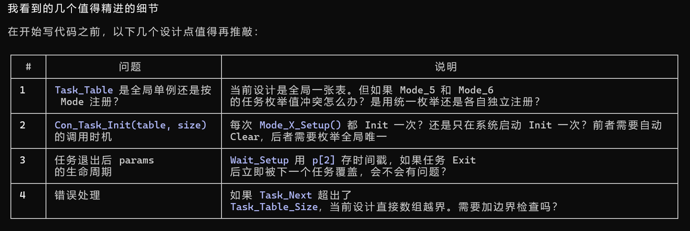

# 1. 模板工程创建

现在我需要你帮我进行工程框架移植，

你现在去到D:\github\HUST_STI\HUST_STI_1\Templete\Template_STM32H743VIT6，读取其内部库文件，比如Mode文件，Hardware文件等，然后构建移植计划，最好是从框架移植开始到功能移植，你现在给我做计划，然后分布移植，每次移植我都要进行检查，注意，移植的时候不要随增减注释，开始计划吧

+++

首先移植Mode文件和Mymain以及AllHeader、MySystem，这是整体架构，我要从架构层面一步一步来

+++

现在我的工程加入了串口DMA(USART0和1)，我想要更新当前的Serial，采用串口DMA进行发送(Serial_Printf)和接收(DMA空闲中断)，先不理USART3和6，然后逻辑保持不变，你来进行计划，列出需要新增、修改、删除什么，我同意之后实施

+++

你现在协助我进行步进电机的驱动，首先查看MySystem是不是对的

+++

现在我要给速度模式加入加速度控制，输入acc = 0的时候没有加速度，也就是正常速度，否则就继续加速度加速，单位是rpm，你觉得要不要放在结构体，然后帮我修改原函数

+++

然后实现目标角度的控制，然后也能配置加速度和速度，实现丝滑角度位移，首先加速到相应速度，然后等到快到位置之后进行减速，加速度也是一样的，如果无法达到目标速度就减速了那就会产生最大速度，反正无论如何最终的速度-时间曲线不是等腰三角形就是等腰梯形，如何实现呢，进行计划

+++

你记住，Key0作为板载按键一般不可使用

Key1和Key2是可以用来进行测试代码的按键

Key3作为编码器按键一般不可使用

+++

 算法基于 匀加速直线运动公式：

  $$v^2 = v_0^2 + 2a \cdot x$$

  其中：
  - $v$ = 当前速度 (rpm/s)
  - $v_0$ = 初始/最小速度 (rpm/s)
  - $a$ = 加速度 (rpm/s²)
  - $x$ = 走过的步数

  加速段（直接用公式）：

  $$v_{current}^2 = v_{min}^2 + 2a \cdot N_{step}$$

  减速段（从最高速度回退）：

  $$v_{current}^2 = v_{start_dec}^2 - 2a \cdot N_{dec_step}$$

  2.3 两种运行场景

  场景A：行程充足（能到达最大速度）

+ 那么就是状态机
  + 首先走加速角度（此刻速度也在加速）
  + 然后走匀速角度（此刻速度为Max)
  + 最后走减速角度（等于加速角度）

+ 场景B：短行程（三角形速度曲线）
  + 首先走加速
  + 到达计算的Max速度
  + 然后减速

+ 我的想法是定义

  + Max速度

  + 加减速角度数
  + Max速度运动的角度数
  + 其他

+ 然后函数(速度（也就是最大速度），加速度，角度)

  + 首先函数进行计算，提前得到是场景A还是B以及各个参数
    + 如果是A，那么首先进行匀加速运动，然后匀速，然后匀减速
    + 如果是B，那么首先进行匀加速运动，然后匀速运动0个角度，然后匀减速
  + 最后实现精确的角度到达

+ 速度配置和角度配置互相覆盖，如果配置了速度模式，那么正在进行的角度模式就取消，反之同理

在脱机阈值（AT24）的调节中，使用Mode1专门用来调节所有的值，那么如果把curr_mode也放入参数中，会导致当改变mode，跳出Mode1，无法继续调节其他值，是否有方法既能调节Mode又能调节退出之后生效

# 2. 2024_E题

现在我们进入新的任务：首先你去到D:\github\2-2-STM32\STM32\Projects\Robot2026\XIAO\Robot_V2，查看队列的代码，然后在我的现在的工程中，新建一份队列代码，// 队列数据类型
typedef Hanger_Status_Typedef QueueData_Typedef;	// 将void*替换成需要的数据结构即可，这里进行注释，我还没想好怎么构建相应的队列的，所以你现在：

1. 进入D:\github\2-2-STM32\STM32\Projects\Robot2026\XIAO\Robot_V2，读取队列的库
2. 移植这个.c和.h到我当前的工程内

+++

接着你可以参考D:\github\2-2-STM32\STM32\Projects\Robot2026\XIAO\Robot_V2的Mode4和Control的逻辑，我希望构建一个这样的逻辑：

1. 队列内有多种动作可以进行定义
2. 每次查看队列是否是空的，如果不空，就进行队列的任务实现，实现包含setup、Run、以及Exit判断，同时不同的任务有不同的中断Tick放在20ms中断中，如果Exit判断成功，那么就自动执行下一个队列
3. 队列的数据结构只需要包含枚举值以及可能传入的参数，但是我也不确定需要传递多少参数，你觉的怎么实现才好呢
4. 你进行计划，我们进行积极讨论

+++

1. 统一枚举，但是在不同的Mode，初始化有清空队列内容的权利
2. 由于我的代码框架是基于Mode的，所以初始化是在Mode切换的
     时候实现的，所以初始化可以继续多次，所以前者需要自动Clear，你可以思考如何实现，并且加入计划 
3. 为什么会有问题，本任务完成不是会被出队吗，难道p[2]会一直保存吗，我不明白
4. 越界进行边界检查，直接进入while(1)死循环，然后Flash_Mode调用LED不断快闪， 现在你基于我当前的回答，再次更新代码计划

+++

先进行实现，然后在Mode2里面初始化注册2个任务：

1. Motor_A以速度30正转，5s之后完成本任务
2. Motor_A旋转到360度，基本静止后完成本任务

+ 然后你可以在Mode2里面使用按键添加任务
  + 不要涉及步进电机和Motor2
  + 不要涉及舵机
+ Mode2的代码尽量简洁，减少全局变量和自定义的函数
+ Mode2需要使用OLED展示Motor_A的参数和队列的相关参数，更加直观

+++

在我的Con_Task加入两个新项目

1. 加入计时器，在任务切换的时候开始计时，任务再次切换的时候相当于刚刚的任务完成了，然后就能得到上次任务的执行时间，我需要你创建一个数组，存储1. 任务枚举名 2. 本次任务完成的时间，后续我可以根据数组的状况来进行Debug和任务的更好的调度
2. 使用宏#define 定义是否开启日志打印模式，打印使用Serial_Printf的Serial1进行打印，关闭宏的时候就关闭打印功能，打印的时机为开启任务的时候打印 [Task:枚举值 Setup] 任务结束的时候打印 [Task:枚举值 Exit Time: 任务执行时间(s)]

+++

记录数组再加入

1. 执行的任务数：第1条就是1，2就是2，这样我就知道执行了多少条
2. 宏：是否在新建表的时候Clear数组，否则我切换Mode但是还在记录可能导致记录溢出

# 3. ICM42688移植

首先D:\github\HUST_STI\HUST_STI_1\Templete\Templete_STM32F407ZGT6\Template_F407ZGT6\Hardware工程的MPU6050的实现逻辑，由于ICM42688和MPU6050的引脚基本一样，都是使用I2C驱动，我打算使用同样的硬件I2C进行驱动，那么首先你需要

+ [ ] 读取D:\github\HUST_STI\HUST_STI_1\Templete\Templete_STM32F407ZGT6\Template_F407ZGT6\Hardware工程，明确只在Mode2和ICM_42688_base.c / .h里面进行代码编写
+ [ ] 读取示例文件，进行代码编写计划
+ [ ] 只使用硬件IIC即可，IIC和MPU6050共用
+ [ ] 模仿MPU6050的base驱动，并且采用名字和API基本相同的数据结构和函数，编写底层驱动

+++

+++

你现在的todo首要就是帮我解决陀螺仪的问题

+ [ ] 扫描本工程的陀螺仪库
+ [ ] 明确所有代码只能写在Mode2
+ [ ] 只需要优化ICM即可，MPU算了
+ [ ] 互补滤波优化方案实现就直接基于现有库
+ [ ] 新的滤波方案则新建新库在Function里面，现在开始：
  + [ ] 目前来说本工程已经包含了MPU6050和ICM42688的底层驱动，但是滤波方法只有互补滤波，在水平状态下yaw的效果不错，但是在倾斜情况下，yaw的偏移很大，所以我希望
    + [ ] 讨论互补滤波下削弱倾斜移动下yaw的偏移，使得其移动会原位之后还能是0度
    + [ ] 完成上面的设想和实现，并且经过我同意之后进行下一项任务：更加优化的滤波算法，实现无论如何抖动，scroll, roll和yaw都能准确无误，这是最终目标！

+++

+ 总结ICM的base驱动和两种滤波方法，写一个md，包含驱动原理、两种滤波方法的API内容、示例程序（初始化+处理+显示）、使用注意事项（比如说处理周期默认是20ms）、芯片级移植注意事项（比如从STM32移植到TIMSPM0、ESP32等）以及其他内容，并且创建一个文件夹，把Mode2当前内容、以及其他库放入，再加上本md一并打包在文件夹内，使得我只要打包给其他Agent和芯片，Agent就能实现丝滑移植和使用，阅读本md的人也能立马会使用本md和函数API

+++

目前本ICM的yaw是顺时针从0减小到-180，然后突变到+180，然后减小到0，我希望还能有一个yaw_abs，只能使用 float ICM_Yaw_Abs_Get()获得，其在每次yaw更新的时候也进行更新，但是顺时针就是一直增大，然后无突变，也就是可以超过180度甚至是360度，即绝对旋转角度（从初始开始）

+++

根据当前的MPU6050和ICM42688的M算法，创立一个IMU.c / .h库，内部使用宏定义确定是使用MPU6050还是ICM，引出的函数包括API：

- IMU_Mahony_Update_Tick
- IMU_Mahony_Calibrate
- IMU_Yaw_Abs_Get
- IMU_Yaw_Abs_Reset
- IMU_Turn_Yaw_Is_Ok_Ex
- IMU_Turn_Yaw_Is_Ok

然后在Mode2写个简单demo例程，完成之后在D:\github\HUST_STI\HUST_STI_1\Templete\Templete_STM32F407ZGT6\Template_F407ZGT6\IMU_Portable_Lib修改的Readme包含MPU和ICM以及联合宏定义库，实现完整陀螺仪体系

+++

新函数/库移植：需要改动的建议：

+ MyI2C不需要移植，因为我本库已经有AT和6050的实现了，暂时不需要新增其他IIC模块
+ Servo不需要新增舵机驱动了
+ BLE不需要移植
+ Orange不需要移植
+  Menu_Param需要移植，关于Orange选择(a) 

